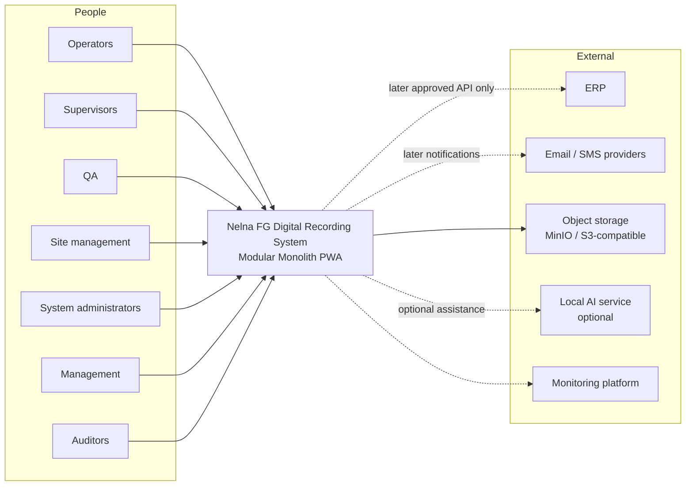

# System Context

**Document status:** Draft architecture context — integrations pending confirmation  
**Phase:** 00 — Discovery and governance  
**Last updated:** 2026-08-04

## Purpose

Describe the people and external systems that interact with the Nelna FG Digital Recording System.

## Actors

| Actor | Interaction |
| --- | --- |
| Operators | Complete assigned recording tasks on mobile PWA; upload evidence as required |
| Supervisors | Check submissions on mobile/tablet; initiate amendments per policy |
| QA | Verify records on tablet/desktop; oversee quality outcomes within approved workflows |
| Site management | Oversee site-scoped operational status (dashboards as approved) |
| System administrators | Manage users, roles, configuration, and operational settings |
| Management | View approved management dashboards and summaries |
| Auditors | Read-only access to records, evidence metadata, and audit exports as authorized |

## External systems

| System | Role | Notes |
| --- | --- | --- |
| ERP | Optional later integration for master or transactional exchange | Not required for MVP floor recording; no direct DB writes |
| Email/SMS providers | Notifications in later phases | Provider selection **DECISION REQUIRED** |
| Object storage | Evidence binaries (MinIO local; S3-compatible production) | Metadata in PostgreSQL |
| Local AI service | Optional assistance (e.g. Ollama) in later phases | Advisory only; never final critical decisions |
| Monitoring platform | Availability, errors, and operational signals | Tooling **DECISION REQUIRED** |

## Mermaid system-context diagram

## Trust and dependency notes

- Factory-floor recording must not require ERP availability.
- AI is optional and non-authoritative for critical decisions.
- Object storage holds evidence; access should use controlled, preferably signed, retrieval patterns.
- Monitoring must not store secrets in this repository.

## References

- [MODULE_MAP.md](MODULE_MAP.md)
- [SECURITY_BASELINE.md](../security/SECURITY_BASELINE.md)
- [AI_SAFETY_POLICY.md](../security/AI_SAFETY_POLICY.md)
