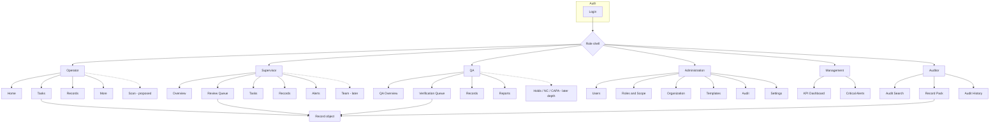

# Information Architecture

**Document status:** Proposed — final navigation pending usability testing  
**Phase:** 01A  
**Last updated:** 2026-08-04

One responsive installable PWA. Navigation differs by role; unauthorized destinations are omitted or denied server-side.

---

## Role-based navigation

### Operator mobile (≤5 primary destinations) — PROPOSED

| Destination | Purpose | MVP |
| --- | --- | --- |
| Home | Due summary, alerts, continue draft | MVP |
| Tasks | Assigned task list | MVP |
| Scan | Barcode/QR to open task/asset — [ASSUMPTION] usefulness | Later / optional MVP spike |
| Records | Own submitted records | MVP |
| More | Profile, language, sync status, help, logout | MVP |

**Proposed until usability testing.** If Scan is not evidenced, replace with Sync or Alerts.

### Supervisor navigation — PROPOSED

| Destination | Purpose | MVP |
| --- | --- | --- |
| Overview | Counts: pending review, failures, overdue | MVP |
| Review Queue | Failures-first review list | MVP |
| Tasks | Team/area task view | MVP concept |
| Team | Who is on shift / assignment glance | Later |
| Records | Scoped record search | MVP |
| Alerts | Critical / escalation inbox | MVP concept; channels [DECISION REQUIRED] |

### QA navigation — PROPOSED

| Destination | Purpose | MVP |
| --- | --- | --- |
| QA Overview | Pending verify, holds, critical | MVP |
| Verification Queue | Supervisor-approved queue | MVP |
| Holds | Active holds | MVP concept / Later depth |
| Non-Conformances | NC list | **Later** (Phase 12) |
| CAPA | CAPA list | **Later** (Phase 12) |
| Records | Scoped search | MVP |
| Reports | Basic export / reports | MVP basic export; rich **Later** |

### Administration navigation — PROPOSED

| Destination | Purpose | MVP |
| --- | --- | --- |
| Users | Named accounts | MVP |
| Roles and Scope | RBAC assignments | MVP |
| Organization | Hierarchy | MVP minimal |
| Master Data | Minimal masters | MVP minimal |
| Checklist Templates | Versioned templates | MVP (2 types) |
| Scheduling | Schedules | MVP light / Phase 07 |
| Integrations | ERP adapters | **Later** |
| Audit | Admin audit views | MVP light |
| System Settings | Env-safe settings | MVP minimal |

### Management navigation — PROPOSED

Primary dashboard: **4–6 actionable KPIs only** (exact KPIs [DECISION REQUIRED]).  
Secondary: Critical alerts · Trend drill-down concept (Later depth).

### Auditor navigation — PROPOSED

Read-only, mutation-free: Audit search · Record pack · Audit event history · Export/print concept.

### Super Administrator

Admin navigation plus elevated System Settings / break-glass recovery — tightly audited.

---

## Sitemap (application objects)

```text
App
├── Auth
│   ├── Login
│   ├── Forced password change
│   ├── Password reset request
│   ├── Account locked
│   ├── Access denied
│   └── Session expired
├── Operator shell
│   ├── Home
│   ├── Tasks → Task detail → Checklist → Failure details → Evidence → Review → Result
│   ├── Records → Own record detail
│   ├── Sync status
│   └── More
├── Supervisor shell
│   ├── Overview
│   ├── Review queue → Record review → Return for correction
│   ├── Tasks (team)
│   └── Records / Alerts
├── QA shell
│   ├── Overview
│   ├── Verification queue → Record verification → Hold/Reject/Reinspect
│   ├── Holds / NC / CAPA (future labeled)
│   └── Records / Reports
├── Admin shell
│   ├── Users / Roles / Organization / Master Data
│   ├── Templates / Scheduling
│   ├── Integrations (later) / Audit / Settings
├── Management shell
│   ├── KPI dashboard / Critical alerts / Trends
└── Auditor shell
    ├── Search / Record pack / Audit history
```

---

## Page hierarchy principles

1. Task → Checklist is the operator primary depth; keep ≤3 taps to first answer when possible.
2. Queues are role home bases for Supervisor/QA.
3. Record detail is a shared object view with role-specific actions.
4. Admin is desktop information-dense; operator is mobile action-dense.
5. Future modules appear in IA as labeled **Later** — not removed from long-term map.

---

## Mobile vs desktop navigation

| Breakpoint | Pattern |
| --- | --- |
| Small/large phone | Bottom nav (operator/supervisor); sticky primary CTA |
| Tablet | Bottom or side nav; split list/detail for queues |
| Laptop/desktop | Persistent side nav; tables for queues; admin console |

---

## Cross-role boundaries

| Boundary | Rule |
| --- | --- |
| Operator ↔ Supervisor | SoD may forbid self-check |
| Supervisor ↔ QA | SoD may forbid same person both roles on same record |
| Auditor | No mutate controls rendered; server denies writes |
| Admin | Cannot use admin tools to silently edit submitted operational answers |
| Loading block | Normal approve unavailable while blocked |

---

## Mermaid information-architecture diagram



---

## Open IA decisions

| ID | Topic | Status |
| --- | --- | --- |
| IA-01 | Keep or drop Scan in operator top-5 | [DECISION REQUIRED] |
| IA-02 | Supervisor Team tab timing | Later vs MVP |
| IA-03 | Management KPI set | [DECISION REQUIRED] |
| IA-04 | QA NC/CAPA nav visible but disabled vs hidden until Phase 12 | [DECISION REQUIRED] |
