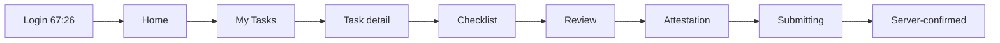
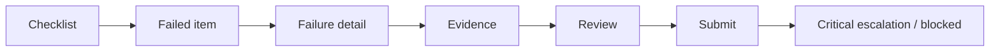
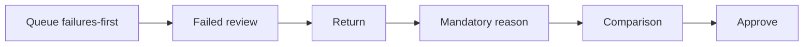
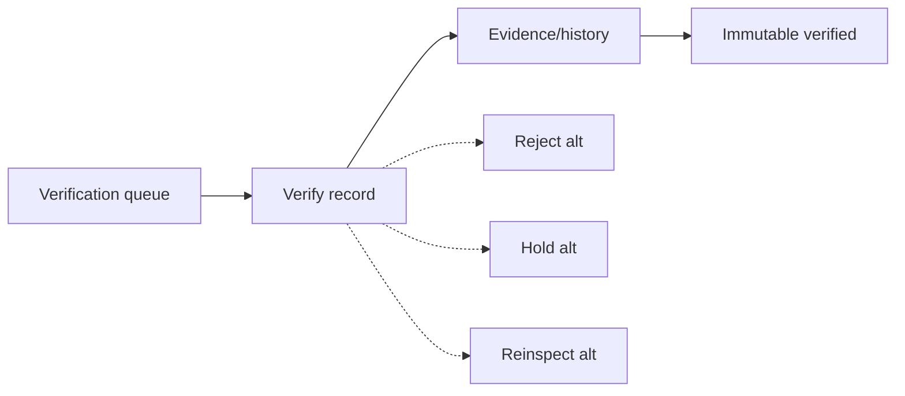
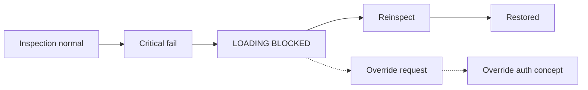
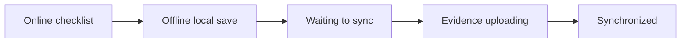
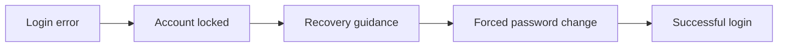

# Prototype Flow Map (01C-R)

**Document status:** Draft pending owner review  
**Figma file:** https://www.figma.com/design/jnn8Xhsg1zFEHxYShCUb4M  
**Page:** 12 Interactive Prototypes (`1:13`)  
**Updated:** 2026-08-05

Prototype destinations are **same-page hi-fi clones** of production representative frames (Figma NAVIGATE cannot cross pages).

## Starting points

| Flow | Start frame | Node ID |
| --- | --- | --- |
| P1 Normal operator checklist | `12/P1/01-login` | `67:26` |
| P2 Operator failure | `12/P2/01-checklist` | `67:228` |
| P3 Supervisor correction | `12/P3/01-queue` | `67:581` |
| P4 QA verification | `12/P4/01-queue` | `67:781` |
| P4 alt Reject | `12/P4-ALT/reject` | `67:1001` |
| P4 alt Hold | `12/P4-ALT/hold` | `67:1045` |
| P4 alt Reinspect | `12/P4-ALT/reinspect` | `67:1087` |
| P5 Loading blocked | `12/P5/01-inspect-normal` | `67:363` |
| P5 override concept | `12/P5-ALT/01-blocked` | `67:496` |
| P6 Offline sync (preferred) | `12/P6B/01-online` | `67:1276` |
| P7 Access problem | `12/P7/01-login-error` | `67:1382` |

## P1 — Normal operator checklist

Mark All Acceptable annotated: **CONFIGURABLE BY CHECKLIST TEMPLATE — BUSINESS APPROVAL REQUIRED**

## P2 — Operator failure

## P3 — Supervisor correction

## P4 — QA verification

## P5 — Loading blocked

No invented temperature threshold.

## P6 — Offline sync

Never skip local-save directly to submitted. Preferred chain starts at `67:1276`.

## P7 — Access problem

## Motion

Reduced-motion annotation: Instant/dissolve only; no decorative animation.
