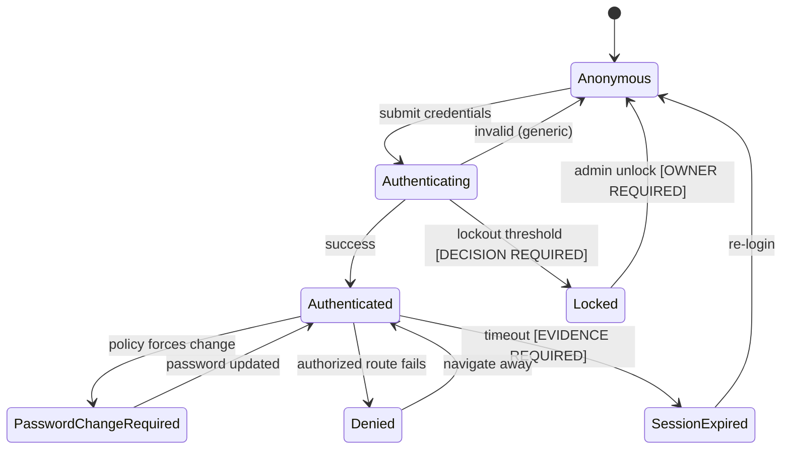
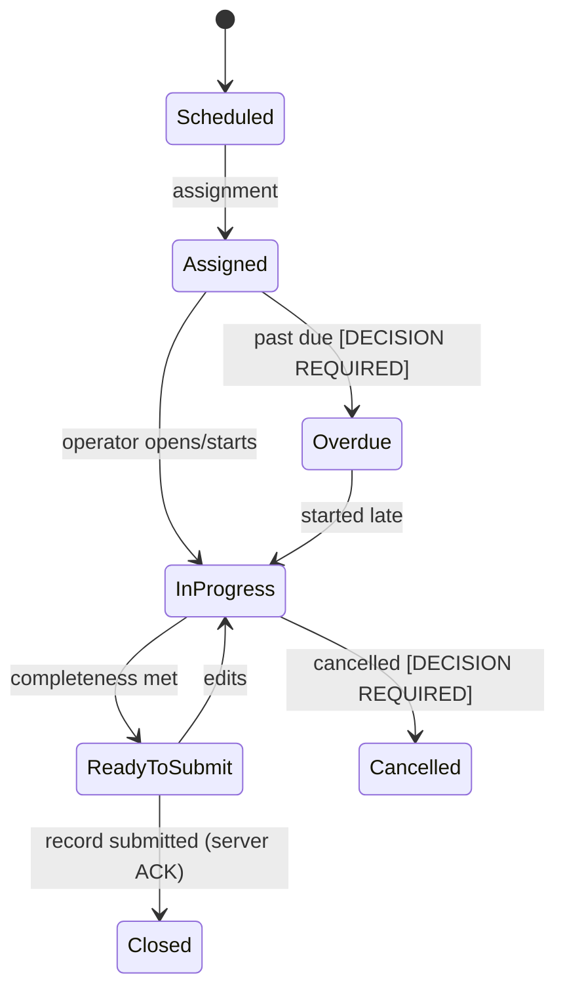
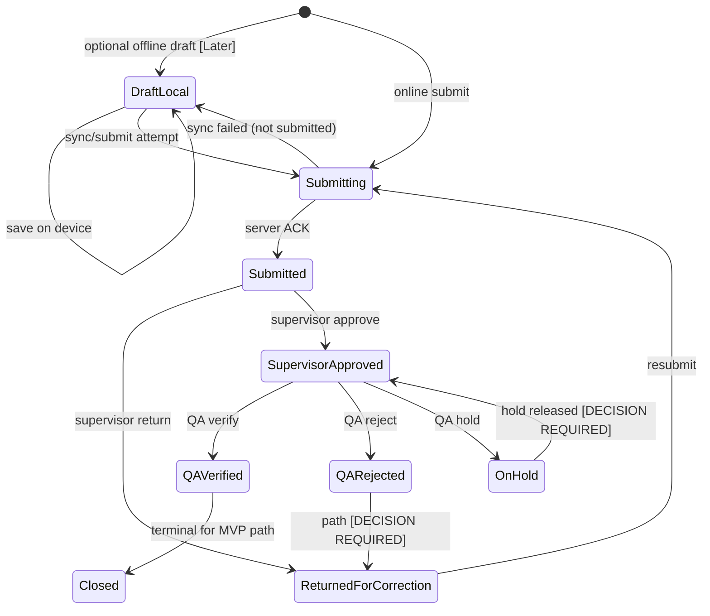
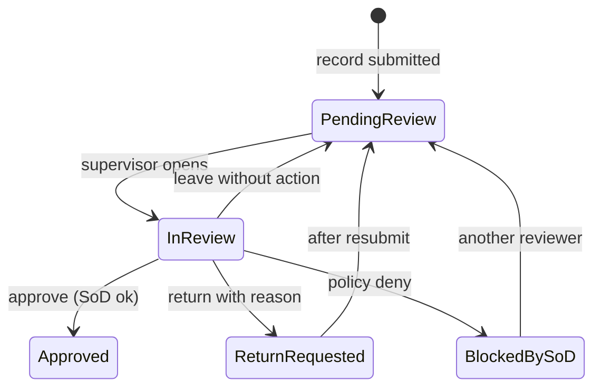
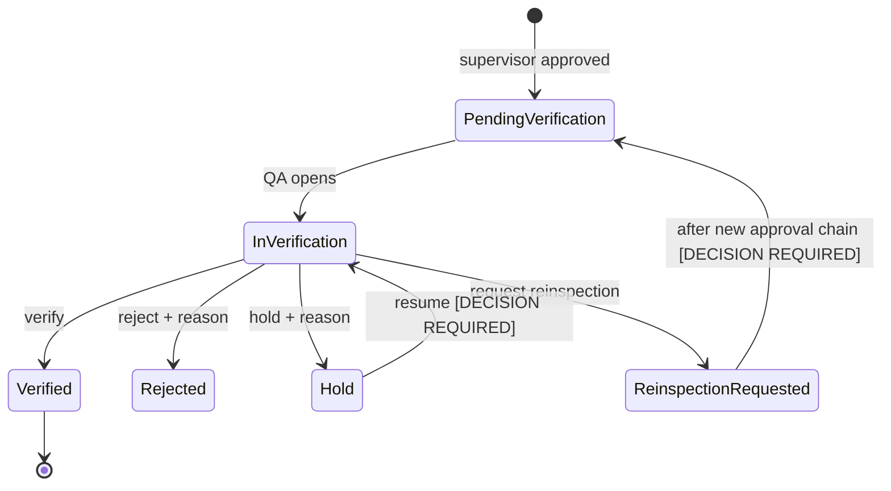
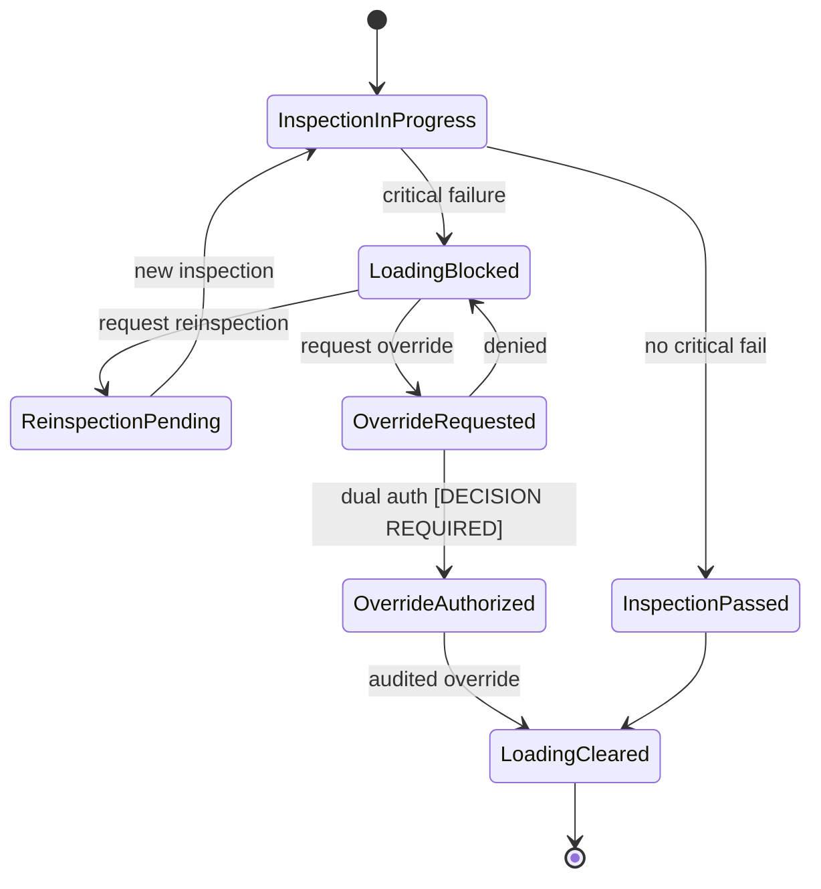
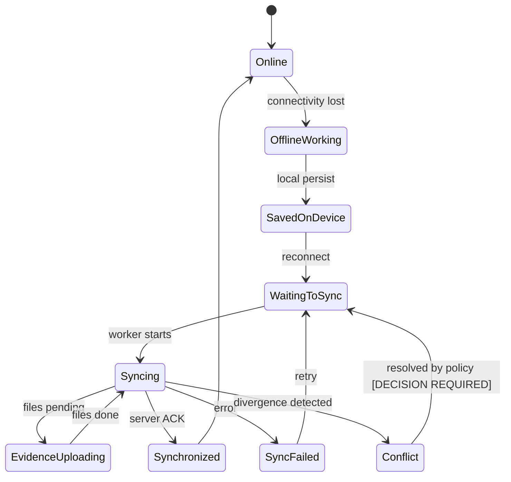

# Workflow State Map

**Document status:** Proposed states — unapproved business transitions marked  
**Phase:** 01A  
**Last updated:** 2026-08-04

Do not treat state names as approved Nelna SOP language until QA signs off.

---

## Authentication

---

## Task

---

## Record

**Rule:** Local draft ≠ Submitted.

---

## Supervisor review

---

## QA verification

NC creation is a **Later** branch from Hold/Reject as approved by QA scope.

---

## Loading block (Later phase)

No temperature thresholds encoded here.

---

## Offline synchronization (design / Later implement)

**Critical wording:** Only `Synchronized` with server ACK may be described as submitted/saved on server.

---

## Open state decisions

| Topic | Status |
| --- | --- |
| Lockout threshold / duration | [DECISION REQUIRED] |
| Task cancel/overdue rules | [DECISION REQUIRED] |
| Hold release authority | [OWNER REQUIRED] |
| Dual authorization for loading override | [DECISION REQUIRED] |
| Conflict resolution policy | [DECISION REQUIRED] |
| Whether QA reject returns to operator or supervisor | [DECISION REQUIRED] |
