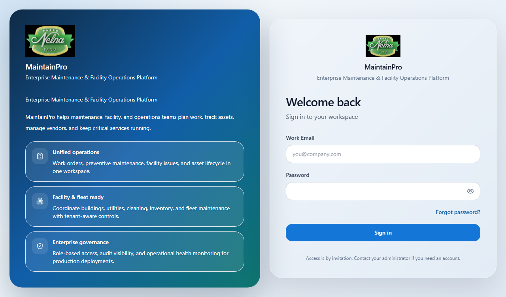
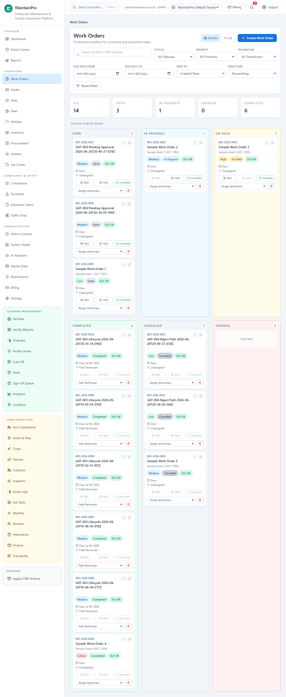
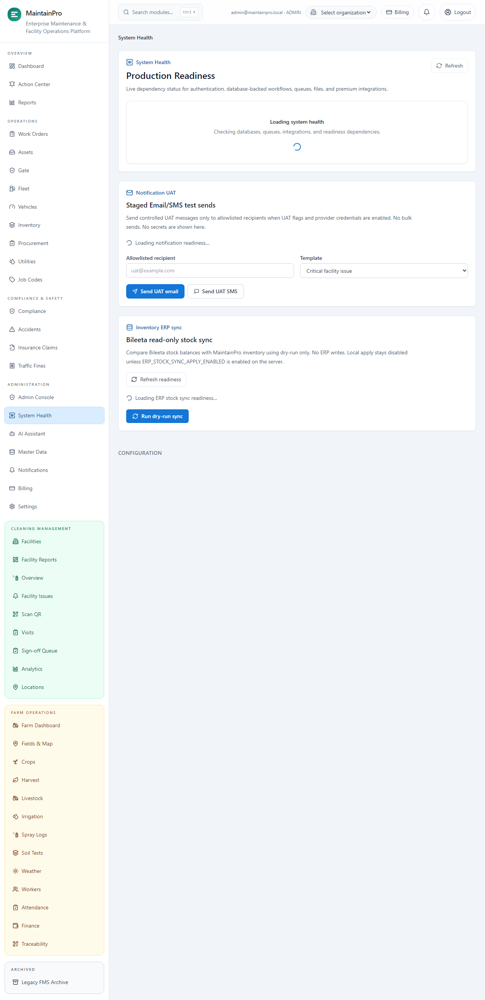
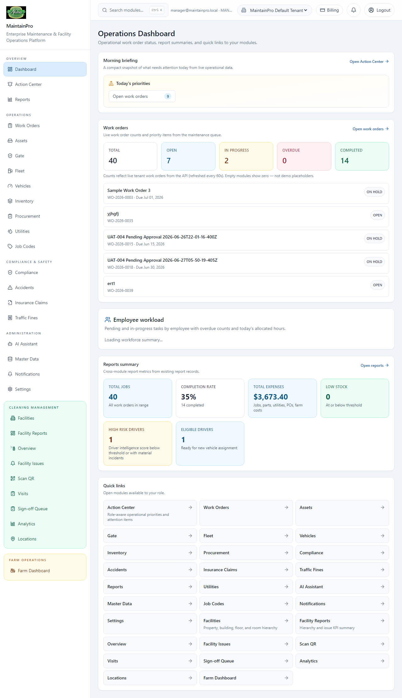
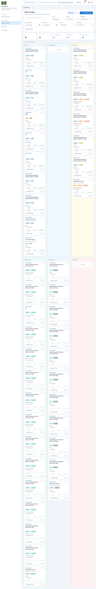
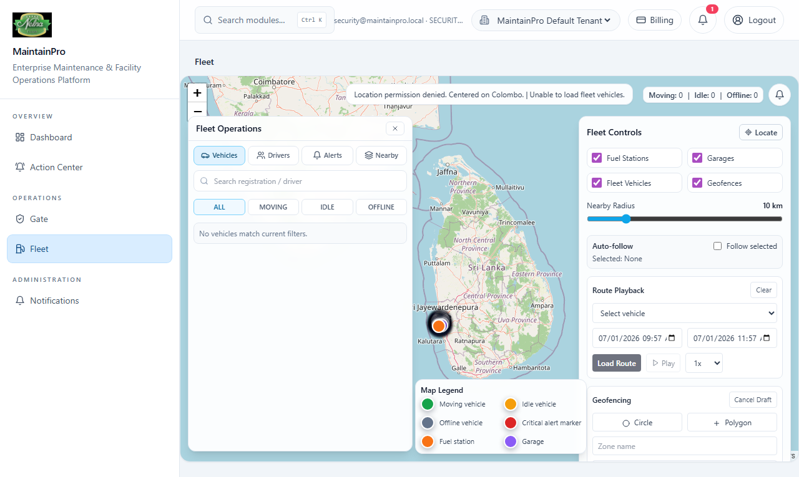
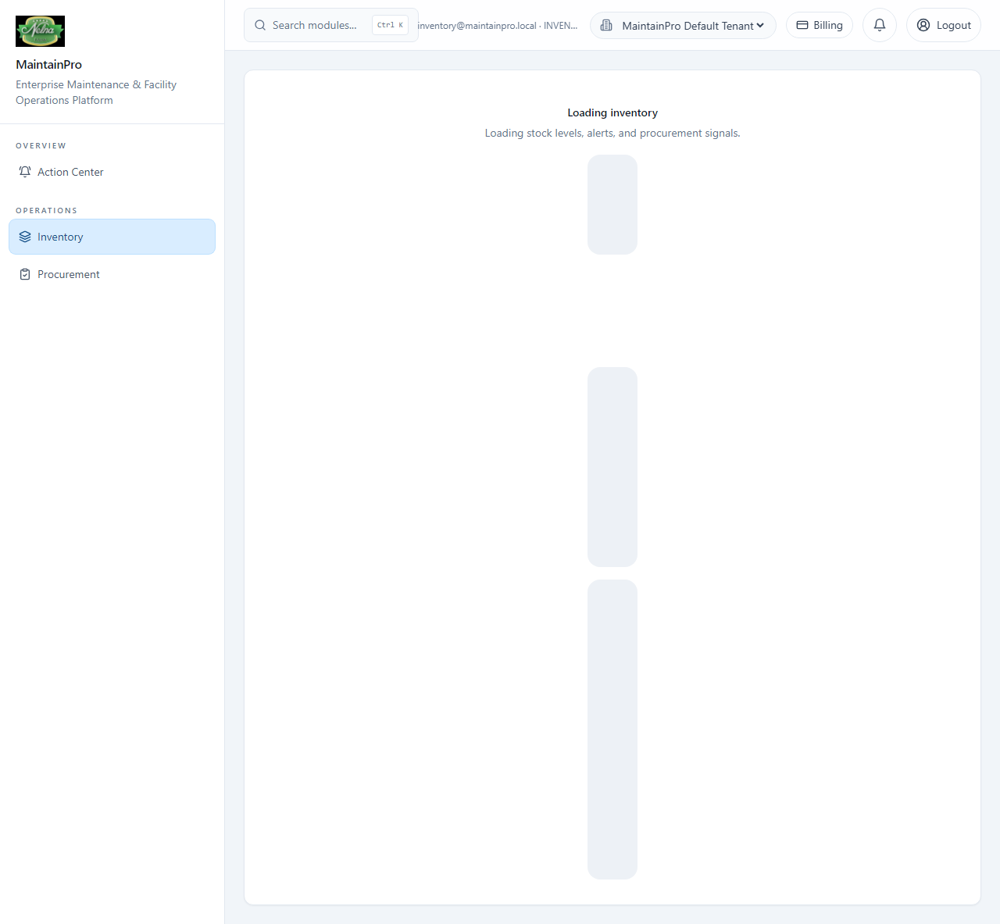
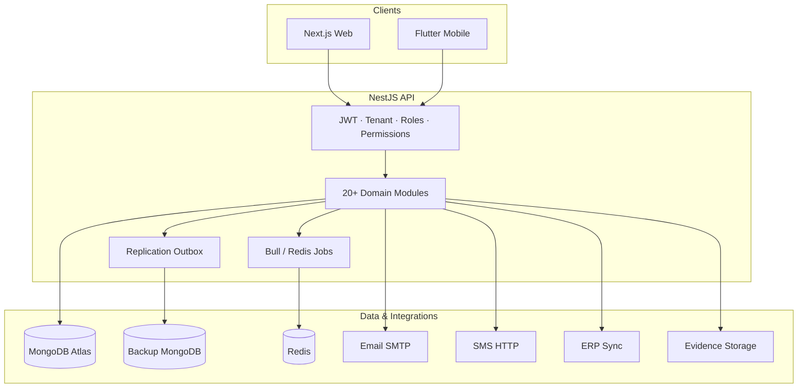

# MaintainPro — Enterprise Operations Platform

**Multi-tenant maintenance, fleet, inventory, and compliance software built for real operations teams.**

| Verdict | Status |
|---------|--------|
| **Portfolio-ready** | Yes — documented, tested, deployed to staging |
| **Pilot-ready** | Yes — scoped rollout on hosted staging |
| **Production-ready** | **No** — DNS cutover, prod DB/env, and live integrations remain operator-owned |

**Live staging:** [Web dashboard](https://newmone.chinthakajayaweera1.workers.dev) · [API health](https://newmone.onrender.com/health)

---

## Executive summary

MaintainPro is a **full-stack enterprise operations platform** I designed and built to replace fragmented Excel, WhatsApp, and disconnected ERP workflows with one accountable system for maintenance, fleet gate compliance, inventory, and reporting.

The product serves **multi-site organizations** where different roles — admins, managers, technicians, security officers, and store keepers — need different views of the same operational truth. The backend enforces **tenant isolation, JWT auth, RBAC, and audit trails**; the web dashboard adapts navigation and KPIs by role; a Flutter mobile foundation supports field execution.

This is not a tutorial CRUD app. It is a **modular monolith** with 20+ domain modules, 500+ automated API tests, Playwright browser UAT on hosted staging, deployment smoke scripts, and production cutover documentation — all verified without claiming features that are not actually live.

**Why it matters for hiring:** MaintainPro demonstrates end-to-end ownership — product thinking, system design, security-aware implementation, DevOps discipline, and honest delivery boundaries.

---

## Business value

| Stakeholder | Problem today | What MaintainPro delivers |
|-------------|---------------|---------------------------|
| **Operations / maintenance** | Jobs lost in chat; unclear ownership | Work order lifecycle, assignment, status, cost tracking |
| **Management** | Reports assembled manually | Role dashboards with live API KPIs, server-side CSV export |
| **Security / gate** | Paper gate logs; expired documents missed | Dedicated Security Officer role, `/fleet/gate`, compliance checks |
| **Stores / inventory** | Untracked spare-part usage | Stock levels, part requests on work orders, ERP sync readiness |
| **IT / DevOps** | “Is it up?” uncertainty | Health/readiness endpoints, provider diagnostics, automated smoke |
| **Compliance / audit** | No single trail | Prisma audit middleware + domain events on high-risk mutations |

**Core workflow shipped:**

```text
Asset / Vehicle → Work Order → Assign → Parts → Execute → Evidence → Complete → Audit → Report
```

Some steps (visual approval builder, mobile signature, full offline parity) remain **partial** — documented openly in the roadmap.

---

## Screenshots

Captured from **hosted staging** during automated UAT (no credentials visible). [Full capture checklist →](docs/screenshots/README.md)

### Admin & operations

| Login | Admin dashboard |
|-------|-----------------|
|  |  |

| Work orders | System health / integrations |
|-------------|------------------------------|
|  |  |

### Role-specific surfaces

| Manager dashboard | Technician jobs | Security gate | Inventory |
|-------------------|-----------------|---------------|-----------|
|  |  |  |  |

### Full gallery

| # | Screen | File |
|---|--------|------|
| 01 | Login | [01-login.png](docs/screenshots/staging/01-login.png) |
| 02 | Admin dashboard | [02-admin-dashboard.png](docs/screenshots/staging/02-admin-dashboard.png) |
| 03 | Admin console | [03-admin-console.png](docs/screenshots/staging/03-admin-console.png) |
| 04 | Manager dashboard | [04-manager-dashboard.png](docs/screenshots/staging/04-manager-dashboard.png) |
| 05 | Work order list | [05-work-order-list.png](docs/screenshots/staging/05-work-order-list.png) |
| 06 | Work order detail | [06-work-order-detail.png](docs/screenshots/staging/06-work-order-detail.png) |
| 07 | Technician jobs | [07-technician-jobs.png](docs/screenshots/staging/07-technician-jobs.png) |
| 08 | Security fleet / gate | [08-security-fleet-gate.png](docs/screenshots/staging/08-security-fleet-gate.png) |
| 09 | Inventory | [09-inventory-stock.png](docs/screenshots/staging/09-inventory-stock.png) |
| 10 | System health | [10-erp-system-health.png](docs/screenshots/staging/10-erp-system-health.png) |
| 11 | Reports hub | [11-reports-dashboard.png](docs/screenshots/staging/11-reports-dashboard.png) |

**Not in web repo:** mobile Flutter UI (`13-mobile-technician.png`). Regenerate: `npm run test:e2e:staging:uat003` (credentials via secret manager only).

---

## Architecture

MaintainPro follows a **modular monolith** pattern: one deployable API with clear domain boundaries, shared Prisma schema, and global guards for auth, tenancy, roles, and permissions.



| Design choice | Rationale |
|---------------|-----------|
| **Multi-tenant monolith** | Faster delivery with module seams; hot paths can extract later |
| **MongoDB + Prisma** | Flexible operational documents; single schema for API + seed |
| **Dual-DB replication** | Async outbox to backup MongoDB for resilience |
| **Env-gated integrations** | Email, SMS, push, ERP, storage default to disabled/mock — no fake “live” claims |
| **Layered guards** | JWT → tenant context → roles → permissions; API is RBAC authority |
| **Health / readiness** | Public liveness + protected deep checks + admin `/system-health` UI |

Deep dive: [docs/ARCHITECTURE.md](docs/ARCHITECTURE.md)

---

## UAT evidence summary

Structured acceptance testing from UAT-001 through UAT-006. Full matrix: [docs/UAT_CHECKLIST.md](docs/UAT_CHECKLIST.md)

| UAT | Status | What was verified |
|-----|--------|-------------------|
| **UAT-001** | **PASS** | Hosted login, deployment smoke, health/CORS |
| **UAT-002** | **PARTIAL PASS** | Multi-role browser personas + hosted API workflows |
| **UAT-003** | **PARTIAL PASS** | Full work-order lifecycle on staging API (create → assign → parts → complete) |
| **UAT-004** | **PARTIAL PASS** | WO approve/reject, audit trail, `/fleet/gate`, evidence readiness indicators |
| **UAT-005** | **PASS** | Provider diagnostics (EMAIL/SMS/PUSH), cutover runbook, staging deploy sync |
| **UAT-006** | **PASS (docs)** | Go-live decision pack, operator checklist, pilot plan — **cutover not executed** |
| **UAT-007** | **PARTIAL PASS** | Multi-assignee WO, conditional asset validation, workload dashboard, leave/capacity API |
| **UAT-008** | **PARTIAL PASS** | WO History tab with legacy/FMS context; admin-only raw archive; UAT-007 preserved |

**Automation behind the evidence:**

- **528+ API tests** (Jest) · **Playwright e2e** on hosted staging (UAT-002/003/004/005)
- **`npm run uat:005:validate`** — full regression chain including typecheck, lint, build, smoke
- **`npm run uat:007:validate`** — workforce planning validation chain
- **`npm run uat:008:validate`** — work order history + legacy nav cleanup validation
- **`npm run smoke:deploy`** — frontend, health, CORS, login against live staging

---

## Production readiness (honest)

MaintainPro is **intentionally not marked production-ready**. Staging proves engineering quality; production requires operator-owned infrastructure work documented in UAT-006.

| Area | Staging status | Production blocker |
|------|----------------|-------------------|
| Core API + RBAC | Verified | — |
| Web dashboard | Verified on Workers | Custom domain `maintenance.nelna.lk` not cut over |
| Database | Staging Atlas | Isolated prod DB + backup policy not provisioned |
| Email / SMS / push | **DISABLED** (honest indicators) | Live credentials + UAT send tests |
| Evidence storage | **DISABLED** | Cloudinary/MinIO + presigned upload UAT |
| Post-cutover smoke | N/A | Must pass on production URLs after cutover |

**Go/no-go recommendation:** **NO-GO for production cutover** until [PRODUCTION_OPERATOR_CHECKLIST.md](docs/PRODUCTION_OPERATOR_CHECKLIST.md) is complete and signed.

| Document | Purpose |
|----------|---------|
| [PRODUCTION_READINESS_REPORT.md](PRODUCTION_READINESS_REPORT.md) | Full readiness matrix |
| [docs/PRODUCTION_GO_LIVE_DECISION_PACK.md](docs/PRODUCTION_GO_LIVE_DECISION_PACK.md) | Management go/no-go pack |
| [docs/PRODUCTION_OPERATOR_CHECKLIST.md](docs/PRODUCTION_OPERATOR_CHECKLIST.md) | DNS, env, DB, integrations |
| [docs/PILOT_ROLLOUT_PLAN.md](docs/PILOT_ROLLOUT_PLAN.md) | Pilot scope, training, escalation |

---

## What I learned

Building MaintainPro reinforced several lessons I would bring to a product engineering team:

1. **Honest integration boundaries beat demo magic.** Env-gated email, SMS, push, and ERP with explicit `ENABLED` / `DISABLED` / `MISCONFIGURED` indicators build trust with operators and interviewers alike.
2. **RBAC must be enforced twice — correctly.** Frontend role nav improves UX, but only API guards (tenant + permissions) are authoritative; I documented and tested both.
3. **Deployment confidence requires automation, not hope.** Smoke scripts with warm-up/retry, Playwright against real staging URLs, and UAT validation chains caught cold-start and selector issues early.
4. **Production readiness is a process, not a commit.** UAT-006 taught me to separate “engineering complete on staging” from “operator cutover complete on prod” with explicit NO-GO criteria.
5. **Multi-tenant monoliths scale team velocity first.** Clear module folders (`work-orders`, `fleet`, `inventory`, …) let me ship domain features without premature microservice overhead.

---

## Interview talking points

| Question | Suggested answer |
|----------|------------------|
| **What did you build?** | Multi-tenant ops platform: maintenance WOs, fleet gate, inventory, reporting — NestJS + Next.js + Flutter, deployed to Render + Cloudflare. |
| **Why a monolith?** | Faster MVP with 20+ domain modules and clear seams; replication outbox and queues already isolate async concerns. |
| **How do you handle security?** | JWT + HttpOnly refresh + CSRF, bcrypt + lockout, Helmet/CSP/HSTS, tenant-scoped Prisma, audit middleware, mock integrations blocked in prod. |
| **How do you know it works?** | 524 API tests, Playwright multi-role UAT on staging, `uat:005:validate` / `uat:007:validate` chains, hosted smoke — all documented in UAT checklist. |
| **What is not done?** | Production DNS, prod DB/env, live notifications/storage, mobile offline parity — I document gaps instead of overselling. |
| **What would you do next?** | Execute operator cutover checklist, cookie-only access tokens, Sentry, predictive maintenance rules, ERP signed mapping UAT. |

Extended narrative: [docs/PORTFOLIO_CASE_STUDY.md](docs/PORTFOLIO_CASE_STUDY.md)

---

## Technology stack

| Layer | Stack |
|-------|--------|
| API | NestJS, TypeScript, Prisma (MongoDB), Redis/Bull, Socket.IO |
| Web | Next.js App Router, TailwindCSS, TanStack Query, Recharts, Leaflet |
| Mobile | Flutter, Riverpod, Dio, Hive offline queue |
| Shared | `packages/shared-types`, `packages/ui-components` |
| Infra | Docker Compose, Render (API), Cloudflare Workers (web), MongoDB Atlas |

---

## Quick start (developers)

```bash
cd maintainpro
cp .env.example .env
npm install
npm run db:generate
npm run db:push
# Set MAINTAINPRO_SEED_PASSWORD from secret manager — never commit
npm run db:seed
npm run dev              # API :3000, Web :3001
```

**Seed personas** (password via `MAINTAINPRO_SEED_PASSWORD` only): `admin@maintainpro.local`, `manager@maintainpro.local`, `tech@maintainpro.local`, `security@maintainpro.local`, `inventory@maintainpro.local` — see `apps/api/src/database/seed.ts`.

## Validation commands

```bash
npm run typecheck
npm run lint
npm run test                 # 524 API tests
npm run build
npm run smoke:deploy         # hosted staging (env vars in shell)
npm run uat:005:validate     # full UAT regression chain
npm run test:e2e:staging:uat003
```

## Deployment

| Target | Config | Doc |
|--------|--------|-----|
| Render API | `render.yaml` | [docs/DEPLOYMENT.md](docs/DEPLOYMENT.md) |
| Cloudflare Web | `wrangler.jsonc` | [docs/DEPLOYMENT.md](docs/DEPLOYMENT.md) |
| Docker | `docker-compose.yml` | README Docker section |

**Staging:** Web [workers.dev](https://newmone.chinthakajayaweera1.workers.dev) · API [onrender.com](https://newmone.onrender.com/api)  
**Production (planned):** `maintenance.nelna.lk` — not live

## Documentation index

| Document | Purpose |
|----------|---------|
| [docs/PORTFOLIO_CASE_STUDY.md](docs/PORTFOLIO_CASE_STUDY.md) | Portfolio narrative |
| [docs/ARCHITECTURE.md](docs/ARCHITECTURE.md) | System design |
| [docs/UAT_CHECKLIST.md](docs/UAT_CHECKLIST.md) | Acceptance testing |
| [docs/ENTERPRISE_ROADMAP.md](docs/ENTERPRISE_ROADMAP.md) | Prioritized roadmap |
| [docs/SECURITY_CHECKLIST.md](docs/SECURITY_CHECKLIST.md) | Security review |
| [PRODUCTION_READINESS_REPORT.md](PRODUCTION_READINESS_REPORT.md) | Go-live gaps |

## Repository layout

```text
maintainpro/
├── apps/api/          NestJS backend
├── apps/web/          Next.js dashboard
├── apps/mobile/       Flutter field app
├── packages/          shared-types, ui-components
├── prisma/            MongoDB schema
├── docs/              runbooks, UAT, screenshots
└── scripts/           smoke, deploy, UAT validators
```

## Contributing

Before push:

```bash
npm run typecheck && npm run lint && npm run test && npm run build
```

Do not commit `.env`, credentials, or secrets.

## License

Private / portfolio use — see repository owner.
