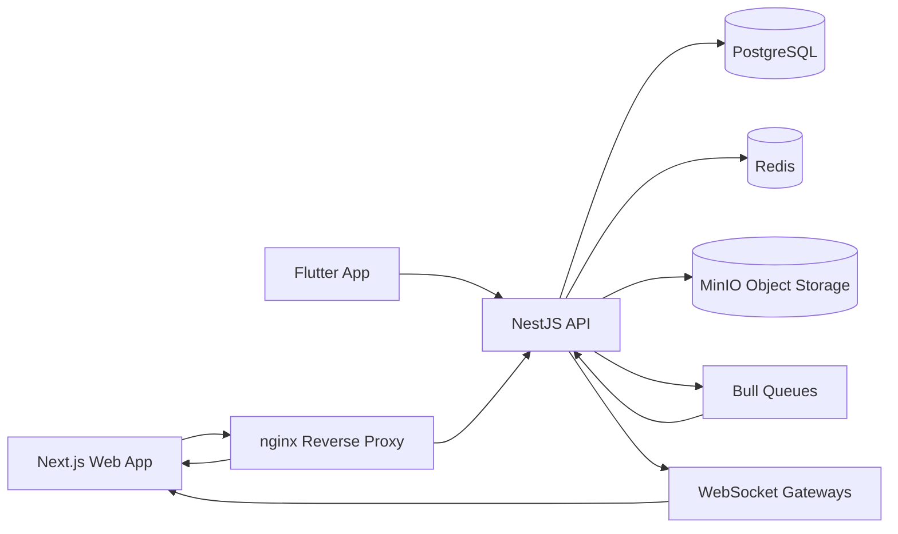

# MaintainPro Enterprise Platform

MaintainPro is an enterprise-grade, multi-module operations platform for asset management, fleet operations, maintenance execution, inventory control, utility tracking, reporting, and predictive analytics.

## Technology Stack

- Backend: NestJS + TypeScript + Prisma + PostgreSQL + Redis + Bull + WebSockets + Swagger
- Frontend: Next.js App Router + TailwindCSS + Recharts + Leaflet
- Mobile: Flutter + Riverpod + Dio + Hive offline queue + QR scanner
- Shared packages: workspace libraries under `packages/`
- Infrastructure: Docker Compose (dev and production), MinIO object storage, nginx reverse proxy
- CI/CD: GitHub Actions for PR validation, Docker build checks, and develop branch staging pipeline

## Architecture



## Repository Layout

```text
maintainpro/
├── apps/
│   ├── api/          # NestJS backend
│   ├── web/          # Next.js web dashboard
│   └── mobile/       # Flutter mobile app
├── packages/
│   ├── shared-types/
│   └── ui-components/
├── prisma/
│   └── schema.prisma
├── infra/
│   └── nginx/default.conf
├── docker-compose.yml
├── docker-compose.dev.yml
└── .github/workflows/
```

## RBAC Matrix

- SUPER_ADMIN: full platform access including tenant-level administration
- ADMIN: operational admin access across modules
- MANAGER: planning, assignment, approvals, and reporting
- TECHNICIAN: maintenance and work-order execution
- DRIVER: fleet usage, trip, and vehicle updates
- VIEWER: read-only analytics and operational visibility

## API Modules

All API routes are prefixed with `/api`.

- Health: `/health`
- Auth: `/auth`
- Users: `/users`
- Roles: `/roles`
- Assets: `/assets`
- Vehicles: `/vehicles`
- Fleet: `/fleet`
- Drivers: `/drivers`
- Maintenance: `/maintenance`
- Work Orders: `/work-orders`
- Inventory: `/inventory`
- Suppliers: `/suppliers`
- Fuel: `/fuel`
- Trips: `/trips`
- Utilities: `/utilities`
- Notifications: `/notifications`
- Reports: `/reports`
- Predictive AI: `/predictive-ai`

Swagger docs: `http://localhost:3000/api/docs` (local API direct) or `http://localhost/api/docs` (via nginx in production compose).

## Local Setup (Node)

1. Copy environment template.

```bash
cp .env.example .env
```

1. Install dependencies.

```bash
npm install
```

1. Generate Prisma client.

```bash
npm run db:generate
```

1. Run API + web.

```bash
npm run dev
```

1. Optional test and build validation.

```bash
npm run typecheck
npm run test
npm run build
```

## Docker Workflows

Development stack:

```bash
npm run docker:up:dev
```

Production-like stack:

```bash
npm run docker:up
```

Stop stacks:

```bash
npm run docker:down:dev
npm run docker:down
```

Production stack includes nginx, API, web, PostgreSQL, Redis, and MinIO.

## Environment Reference

See `.env.example` for all variables.

Critical required keys for backend startup:

- `CORS_ORIGIN`, `FRONTEND_URL`
- `DATABASE_URL`
- `JWT_SECRET`, or both `JWT_ACCESS_SECRET` and `JWT_REFRESH_SECRET`

Optional backend integrations:

- `REDIS_URL` enables managed Redis-backed queues.
- `CLOUDINARY_CLOUD_NAME`, `CLOUDINARY_API_KEY`, `CLOUDINARY_API_SECRET` enable persistent asset document uploads on Render.
- `MINIO_ENDPOINT`, `MINIO_PORT`, `MINIO_ACCESS_KEY`, `MINIO_SECRET_KEY`, `MINIO_BUCKET` enable S3-compatible object storage health checks.
- `SMTP_HOST`, `SMTP_PORT`, `SMTP_USER`, `SMTP_PASS`, `SMTP_FROM` enable SMTP notifications.
- `RAPIDAPI_GOOGLE_MAP_PLACES_KEY` enables Street View previews in the fleet map.
- `RAPIDAPI_COPILOT_API_KEY`, `RAPIDAPI_COPILOT_HOST` enable the predictive copilot provider.
- `RAPIDAPI_QR_CODE_API_KEY`, `RAPIDAPI_QR_CODE_HOST` optionally route QR image generation through RapidAPI. If omitted, the API falls back to local QR generation automatically.
- `RAPIDAPI_QR_CODE_COLOR`, `RAPIDAPI_QR_CODE_BG_COLOR` customize provider-generated QR colors when the RapidAPI QR provider is enabled.
- `MONGODB_URI` plus `MONGO_SYNC_ON_STARTUP=true` mirrors all Prisma model data into MongoDB Atlas on every API startup.

Frontend runtime keys:

- `NEXT_PUBLIC_API_URL`
- `NEXT_PUBLIC_API_BASE_URL`
- `NEXT_PUBLIC_API_ORIGIN`

## Database and Seed

- Prisma schema: `prisma/schema.prisma`
- Generate client: `npm run db:generate`
- Run migration (local): `npm run db:migrate`
- Seed data: `npm run db:seed`

Seed includes baseline roles, permissions, admin users, and sample domain entities across assets, vehicles, inventory, work orders, and utilities.

## CI/CD

GitHub workflows:

- `ci.yml`: PR validation (typecheck, build, tests)
- `docker-build-check.yml`: verifies Docker images and compose config
- `develop-staging-deploy.yml`: develop-branch staging build/deploy placeholder

## Vercel Web Deployment

For the full Vercel, Render, MongoDB Atlas, Cloudinary, and smoke-test checklist, see [DEPLOYMENT_GUIDE.md](DEPLOYMENT_GUIDE.md).

The Next.js web app lives in `apps/web`, while the deployable monorepo root is `maintainpro`. The repository includes Vercel config for both common setups:

- If the Vercel project root is the Git repository root, `../vercel.json` runs `cd maintainpro && npm run vercel:build` and serves `maintainpro/apps/web/.next`.
- If the Vercel project root is `maintainpro`, `vercel.json` runs `npm run vercel:build` and serves `apps/web/.next`.

Set these Vercel environment variables for hosted API connectivity:

- `NEXT_PUBLIC_API_URL`, for example `https://api.example.com/api`
- `NEXT_PUBLIC_API_BASE_URL`, for example `https://api.example.com/api`
- `NEXT_PUBLIC_API_ORIGIN`, for example `https://api.example.com`

Configure repository secrets for staging deploy automation:

- `STAGING_HOST`
- `STAGING_USER`
- `STAGING_SSH_KEY`

## Contribution Guide

1. Create a feature branch from `develop`.
2. Keep changes modular by app/package.
3. Run `npm run typecheck`, `npm run test`, and `npm run build` before opening PR.
4. Update docs and `.env.example` whenever env or architecture changes.
5. Open a PR to `develop` and ensure all workflows pass.

## Security Notes

- Global request validation is enabled in NestJS.
- JWT guard + role guard enforce route access.
- Response envelope and exception filter standardize API behavior.
- Rate limiting is enabled with Nest throttler.
- Use strong secrets and rotate credentials for non-local environments.
