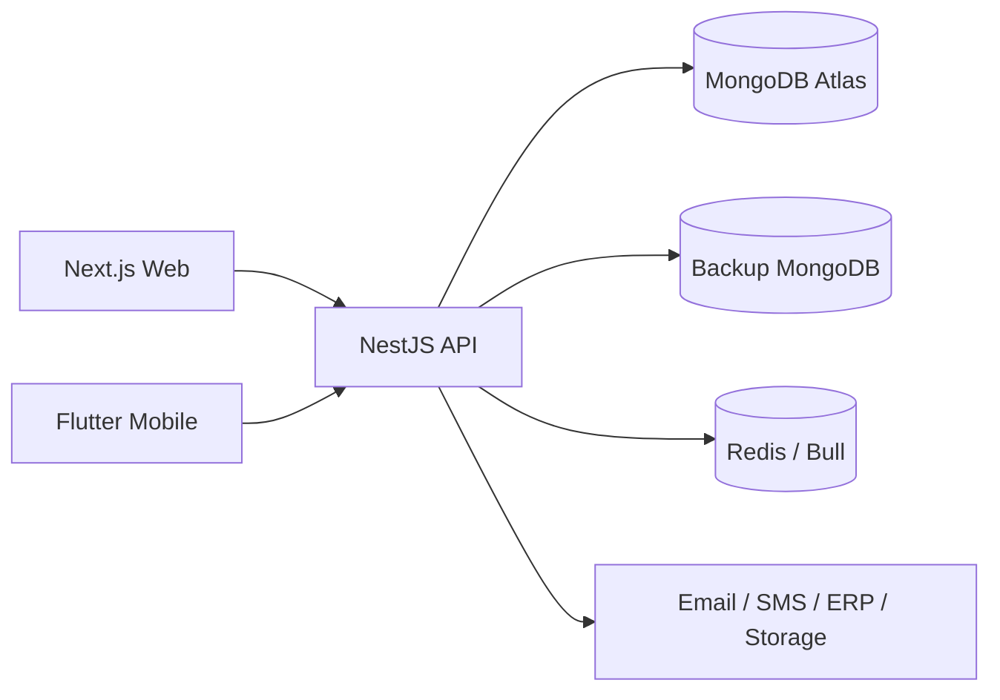

# MaintainPro — Enterprise Operations Platform

MaintainPro is a **multi-tenant enterprise operations, maintenance, fleet, inventory, compliance, and reporting platform** designed to reduce equipment downtime, improve operational accountability, control spare-part usage, track compliance, and give management visibility across sites and departments.

## Business problem

Many organizations still manage maintenance, fleet, stock, compliance documents, and operational issues using Excel, paper forms, WhatsApp, and disconnected ERP workflows. That causes delays, weak accountability, stock leakage, duplicate data entry, and poor management visibility.

MaintainPro connects these workflows in one platform with tenant isolation, role-based access, audit trails, and integration readiness.

## Solution overview

| Capability | Description |
|------------|-------------|
| Asset & vehicle register | Identification, location, status, criticality, QR/scan hooks |
| Work orders | Corrective/preventive jobs, assignment, status, cost, evidence |
| Inventory & parts | Stock, reservations, part requests on work orders |
| Fleet & gate operations | Live map, trips, **gate-in/gate-out** with compliance checks |
| Facilities & cleaning | Hierarchy, issues, SLA/aging reports |
| Compliance & documents | Expiry tracking, vehicle documents |
| Notifications | Email/SMS/push (env-gated; see readiness table) |
| ERP sync | Read-only stock sync (mock/sandbox/live modes) |
| Reporting & dashboards | Role-aware KPIs from live API data |
| Audit | Prisma middleware + domain audit for high-risk actions |

## Core MVP workflow

```text
Asset / Vehicle Register
  → Work Order Creation
  → Manager Approval (where configured)
  → Technician Assignment
  → Spare-Part Reservation
  → Mobile / Web Job Execution
  → Photo / Evidence
  → Supervisor Verification
  → Cost Calculation
  → Completion
  → Audit Trail
  → Dashboard / Report
```

**Status:** End-to-end flow is **implemented in modular form** across API modules and web/mobile surfaces. Some steps (approval builder, signature capture, full offline mobile parity) remain **partial** — see [docs/ENTERPRISE_ROADMAP.md](docs/ENTERPRISE_ROADMAP.md).

## Technology stack

| Layer | Stack |
|-------|--------|
| API | NestJS, TypeScript, Prisma (MongoDB), Redis/Bull, Socket.IO |
| Web | Next.js App Router, TailwindCSS, TanStack Query, Recharts, Leaflet |
| Mobile | Flutter, Riverpod, Dio, Hive offline queue |
| Shared | `packages/shared-types`, `packages/ui-components` |
| Infra | Docker Compose, nginx, Render (API), Cloudflare Workers (web), MongoDB Atlas |

## Architecture

See [docs/ARCHITECTURE.md](docs/ARCHITECTURE.md) for module map, tenancy, auth, replication, and integration boundaries.



## Current deployment status

| Environment | Web | API | Notes |
|-------------|-----|-----|-------|
| **Staging** | [newmone.chinthakajayaweera1.workers.dev](https://newmone.chinthakajayaweera1.workers.dev) | [newmone.onrender.com/api](https://newmone.onrender.com/api) | Hosted smoke: health/CORS OK; login requires aligned seed/smoke password |
| **Production** | `maintenance.nelna.lk` (planned) | TBD | Cutover checklist in [docs/FINAL_UAT_AND_CUTOVER_CHECKLIST.md](docs/FINAL_UAT_AND_CUTOVER_CHECKLIST.md) |

**Health endpoints**

- `GET /health` — public liveness (DB ping)
- `GET /health/readiness` — dependency matrix (protected in production)
- Web: `/system-health` — admin UI over readiness API

## What is complete vs partial vs mock

| Area | Status |
|------|--------|
| Multi-tenant API + RBAC | **Complete** |
| JWT + HttpOnly refresh cookie + CSRF on cookie auth | **Complete** |
| `SECURITY_OFFICER` role, seed, gate permissions | **Complete** |
| Work orders, assets, vehicles, inventory, fleet | **Complete** (core CRUD + workflows) |
| Audit logging (middleware + domain events) | **Complete** |
| Role-based web navigation & dashboards | **Partial** (UX layer; API is authoritative) |
| Email notifications | **Partial** — live when `EMAIL_MODE=live` + SMTP |
| SMS notifications | **Partial** — generic HTTP provider; mock mode available |
| Push notifications | **Partial** — noop/mock default; HTTP provider when configured |
| ERP stock sync | **Partial** — mock default; sandbox/live HTTP read sync |
| Billing / Stripe | **Partial** — mock/disabled modes |
| Predictive maintenance AI | **Partial** — rules + copilot integration hooks |
| Mobile offline queue | **Partial** — Hive queue exists; not all mutations covered |
| Production custom domain | **Not started** |

Honest detail: [PRODUCTION_READINESS_REPORT.md](PRODUCTION_READINESS_REPORT.md).

## Repository layout

```text
maintainpro/
├── apps/api/          NestJS backend
├── apps/web/          Next.js dashboard
├── apps/mobile/       Flutter field app
├── packages/          shared-types, ui-components
├── prisma/            MongoDB schema
├── docs/              runbooks, checklists, architecture
└── scripts/           smoke, deploy helpers
```

## Local setup

```bash
cd maintainpro
cp .env.example .env
npm install
npm run db:generate
npm run db:push          # push schema to MongoDB
# Set MAINTAINPRO_SEED_PASSWORD from secret manager:
npm run db:seed
npm run dev              # API :3000, Web :3001
```

## Seed users (local/staging)

Password: set via `MAINTAINPRO_SEED_PASSWORD` (never commit). Typical seeded accounts:

| Email | Role |
|-------|------|
| `superadmin@maintainpro.local` | SUPER_ADMIN |
| `admin@maintainpro.local` | ADMIN |
| `manager@maintainpro.local` | MANAGER |
| `tech@maintainpro.local` | TECHNICIAN |
| `inventory@maintainpro.local` | INVENTORY_KEEPER |
| `security@maintainpro.local` | SECURITY_OFFICER |

See seed source: `apps/api/src/database/seed.ts`.

## Validation commands

```bash
npm run typecheck
npm run lint
npm run test                 # API Jest (93+ suites)
npm run build
npm run deploy:check
npm run smoke:local          # requires local API + smoke env
npm run smoke:deploy         # hosted staging smoke
npm run test:e2e             # Playwright (local web server)
npm run test:e2e:staging     # Playwright against hosted web (env credentials)
npm run test:e2e:staging:uat002
npm run test:e2e:staging:uat003
npm run uat:002:validate
npm run uat:003:validate     # MVP lifecycle API + portfolio e2e + full regression
npm run uat:004:validate     # Production hardening sprint 1 + UAT-003 regression
```

## Deployment

| Target | Config | Doc |
|--------|--------|-----|
| Render API | `render.yaml` | [docs/DEPLOYMENT.md](docs/DEPLOYMENT.md) |
| Cloudflare Web | `wrangler.jsonc` | [docs/DEPLOYMENT.md](docs/DEPLOYMENT.md) |
| Vercel Web | `vercel.json` | [DEPLOYMENT_GUIDE.md](DEPLOYMENT_GUIDE.md) |
| Docker | `docker-compose.yml` | README Docker section |

## Security highlights

- Global JWT, tenant context, role, and permission guards
- Password hashing (bcrypt), login lockout, refresh rotation
- HttpOnly refresh cookies + CSRF double-submit for cookie-based refresh
- Helmet on API; CSP/HSTS/frame denial on web (`next.config.mjs`)
- Env validation at boot (`env.validation.ts`); mock integrations blocked in production by default
- Tenant-scoped Prisma queries; audit middleware on mutations

See [docs/SECURITY_CHECKLIST.md](docs/SECURITY_CHECKLIST.md).

## Role-based experience

Navigation and dashboards adapt by role (frontend UX). Backend RBAC is authoritative.

| Role | Primary surfaces |
|------|------------------|
| SUPER_ADMIN / ADMIN | Admin console, system health, users, tenants |
| MANAGER / SUPERVISOR | Dashboard, work orders, approvals, reports |
| TECHNICIAN / MECHANIC | Assigned jobs, work order execution |
| SECURITY_OFFICER | Gate in/out, scan lookup, fleet visibility |
| INVENTORY / STORE roles | Inventory, part requests, ERP sync panel |
| VIEWER / AUDITOR | Read-only reports |

Full matrix: [docs/ROLE_MATRIX.md](docs/ROLE_MATRIX.md).

## Documentation index

| Document | Purpose |
|----------|---------|
| [PRODUCTION_READINESS_REPORT.md](PRODUCTION_READINESS_REPORT.md) | Go-live verdict and gaps |
| [docs/ARCHITECTURE.md](docs/ARCHITECTURE.md) | System design |
| [docs/ROLE_MATRIX.md](docs/ROLE_MATRIX.md) | Roles and permissions |
| [docs/UAT_CHECKLIST.md](docs/UAT_CHECKLIST.md) | Acceptance testing |
| [docs/SECURITY_CHECKLIST.md](docs/SECURITY_CHECKLIST.md) | Security review |
| [docs/ENTERPRISE_ROADMAP.md](docs/ENTERPRISE_ROADMAP.md) | Prioritized roadmap |
| [docs/DEPLOYMENT.md](docs/DEPLOYMENT.md) | Deploy runbook |
| [docs/PORTFOLIO_CASE_STUDY.md](docs/PORTFOLIO_CASE_STUDY.md) | Portfolio narrative |
| [docs/FINAL_UAT_AND_CUTOVER_CHECKLIST.md](docs/FINAL_UAT_AND_CUTOVER_CHECKLIST.md) | Staging UAT & cutover |

## Roadmap

Priority features and Phase 2/3 items: [docs/ENTERPRISE_ROADMAP.md](docs/ENTERPRISE_ROADMAP.md).

## Portfolio value

MaintainPro demonstrates **enterprise software engineering** across:

- Multi-tenant SaaS architecture with MongoDB + replication outbox
- Modular monolith domain design (20+ bounded contexts)
- RBAC with permission guards and audit trails
- Real-world workflows (work orders, gate compliance, inventory, ERP readiness)
- Production deployment (Render + Cloudflare + Atlas)
- Security-aware auth (JWT hybrid, CSRF, env-gated integrations)
- Observability (health/readiness, queue health, system health UI)
- Test discipline (500+ API tests, Playwright e2e, deployment smoke)

Case study narrative: [docs/PORTFOLIO_CASE_STUDY.md](docs/PORTFOLIO_CASE_STUDY.md).

## Screenshots

Staging portfolio captures (UAT-003 warm session, no credentials visible):

| Screen | File |
|--------|------|
| Login | [docs/screenshots/staging/01-login.png](docs/screenshots/staging/01-login.png) |
| Admin dashboard | [docs/screenshots/staging/02-admin-dashboard.png](docs/screenshots/staging/02-admin-dashboard.png) |
| Admin console | [docs/screenshots/staging/03-admin-console.png](docs/screenshots/staging/03-admin-console.png) |
| Manager dashboard | [docs/screenshots/staging/04-manager-dashboard.png](docs/screenshots/staging/04-manager-dashboard.png) |
| Work order list | [docs/screenshots/staging/05-work-order-list.png](docs/screenshots/staging/05-work-order-list.png) |
| Work order detail | [docs/screenshots/staging/06-work-order-detail.png](docs/screenshots/staging/06-work-order-detail.png) |
| Technician jobs | [docs/screenshots/staging/07-technician-jobs.png](docs/screenshots/staging/07-technician-jobs.png) |
| Security fleet / gate | [docs/screenshots/staging/08-security-fleet-gate.png](docs/screenshots/staging/08-security-fleet-gate.png) |
| Inventory | [docs/screenshots/staging/09-inventory-stock.png](docs/screenshots/staging/09-inventory-stock.png) |
| System health / ERP | [docs/screenshots/staging/10-erp-system-health.png](docs/screenshots/staging/10-erp-system-health.png) |
| Reports hub | [docs/screenshots/staging/11-reports-dashboard.png](docs/screenshots/staging/11-reports-dashboard.png) |

**NOT AVAILABLE in web repo:** `13-mobile-technician.png` (Flutter `apps/mobile`). **OPERATOR-OWNED:** `12-audit-trail.png` if Settings audit tab not visible on staging.

Regenerate: `npm run test:e2e:staging:uat003` or `npm run uat:003:validate` (requires Render-aligned seed password via `.env.render.local` or shell).

**UAT status:** UAT-001 **PASS** · UAT-002 **PARTIAL PASS** · UAT-003 **PARTIAL PASS** · UAT-004 **PARTIAL PASS** · UAT-005 **PASS** (staging deployment sync + validation).

**Readiness:** Portfolio-ready **YES** · Pilot-ready **YES** · Production-ready **NO**

## Contributing

Work on `main` for this portfolio repo. Before push:

```bash
npm run typecheck && npm run lint && npm run test && npm run build
```

Do not commit `.env`, credentials, or secrets.

## License

Private / portfolio use — see repository owner.
