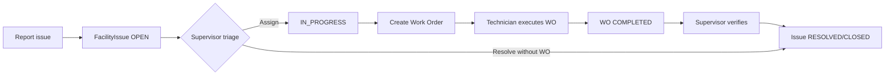

# Building / Facility Maintenance Module Plan

**Task:** BUILD-001  
**Status:** Planning complete — no schema or runtime implementation in this pass  
**Audience:** Nelna operations, facility supervisors, engineering, product  
**Last updated:** 2026-06-13

---

## 1. Purpose

Define a practical Building / Facility maintenance module for MaintainPro that supports Nelna’s property operations without duplicating Work Orders, Assets, Cleaning, Inventory, or Procurement. This document is the implementation blueprint for FAC-001 through FAC-010 and related REQ-INTAKE work.

---

## 2. Business problem

Nelna needs to:

- Register buildings, floors, and rooms as first-class locations (not free-text fields).
- Accept facility repair requests (internal staff and, later, public/requester intake).
- Track issue severity, assignment, SLA, and resolution.
- Convert issues into maintenance work using the existing Work Order lifecycle.
- Link repairs to building assets/equipment and spare parts where applicable.
- Coordinate with cleaning operations when issues originate from janitorial visits.
- Provide supervisors and managers with dashboards and exportable reports.
- Enforce tenant isolation and role-based access across all facility data.

Today the platform has **partial coverage** via Cleaning + `FacilityIssue`, but lacks spatial hierarchy, dedicated facility routes, schema-backed facility roles, and issue→work-order integration.

---

## 3. Audit findings (current system)

### 3.1 What already exists

| Area | Current state | Key paths |
|------|---------------|-----------|
| **Facility issues** | `FacilityIssue` model with severity, status, photos, SLA fields, optional `CleaningLocation` link | `prisma/schema.prisma`, `cleaning.service.ts`, `/cleaning/issues` |
| **Cleaning locations** | `CleaningLocation` with string `building`/`floor`, QR, geo, cleaner assignment | `cleaning/` module, `/cleaning/locations` |
| **Work orders** | Full WO module: status, type, technician, parts, SLA fields | `work-orders/` module, `/work-orders` |
| **Assets** | `Asset` with `INFRASTRUCTURE` category, department, location text, QR, maintenance history | `assets/` module, `/assets` |
| **Inventory / procurement** | Spare parts, stock, PO workflow, WO-linked part requests/issues | `inventory/`, `suppliers/`, `/procurement` |
| **Notifications** | `FACILITY_ISSUE_REPORTED` type, FacilityIssue deep-links | `notifications.service.ts` |
| **Reports** | Module exports for assets, inventory, work orders, etc. — **no facility/cleaning module** | `reports.service.ts` |
| **Web UX** | Cleaning vertical complete; role redirects reference `/facility` routes that **do not exist** | `role-redirect.ts`, `navigation.ts` |

### 3.2 Gaps

| Gap | Impact |
|-----|--------|
| No Property → Building → Floor → Room hierarchy | FAC-001/002/003 blocked |
| No dedicated `facility` API module | Issues buried under `/cleaning/issues`; no building CRUD |
| No `/facility/*` web routes | `FACILITY_MANAGER` / `BUILDING_SUPERVISOR` redirects broken |
| `BUILDING_SUPERVISOR`, `FACILITY_MANAGER` not in Prisma `RoleName` | Frontend RBAC ahead of backend seed |
| No `FacilityIssue.workOrderId` | FAC-008 blocked |
| No issue categories | FAC-007 / REQ-INTAKE blocked |
| No public repair portal | FAC-006 blocked |
| No facility KPIs or report module keys | FAC-009/010 blocked |

### 3.3 Architecture direction (chosen)

**Combination approach:**

1. **New facility spatial hierarchy** — Property → Building → Floor → Room (new models).
2. **Extend existing entities** — do not duplicate Work Order or Asset engines.
3. **New `facility` module** — owns hierarchy CRUD, issue categories, issue→WO bridge, KPIs; cleaning module stays focused on visits/checklists.
4. **Extend `FacilityIssue`** — add `roomId`, `categoryId`, `workOrderId`, optional `assetId`; keep cleaning location link during migration.
5. **Extend `WorkOrder`** — add optional `facilityIssueId`, new type `FACILITY_REPAIR` (or reuse `CORRECTIVE`).
6. **Reuse `Asset`** — link to `roomId`; extend categories for building register (FAC-004/005).

```text
Property → Building → Floor → Room
                              ├── CleaningLocation (optional FK roomId)
                              ├── Asset (optional FK roomId)
                              └── FacilityIssue
                                      └── WorkOrder (optional FK facilityIssueId)
                                              └── PartRequest / PartIssue
```

---

## 4. Reuse vs new-build decisions

| Capability | Decision | Rationale |
|------------|----------|-----------|
| Issue tracking | **Extend `FacilityIssue`** | Model + API + UI exist |
| Repair execution | **Reuse `WorkOrder`** | Mature lifecycle, parts, technician assignment |
| Building equipment | **Reuse `Asset`** | QR, documents, maintenance history already built |
| Cleaning areas | **Extend `CleaningLocation`** | Add `roomId` FK; deprecate string building/floor over time |
| Spare parts | **Reuse PartRequest/PartIssue** | Already WO-integrated |
| Procurement | **Reuse inventory PO flow** | No new procurement module |
| Notifications | **Extend existing rules** | `FACILITY_ISSUE_REPORTED` pattern exists |
| Reports | **Add facility module keys** | Follow `ReportModuleKey` pattern |
| SLA engine | **Defer to WO-004** | Use existing `slaTargetAt` on issues + WO SLA fields for MVP |
| Duplicate WO logic | **Do not build** | Bridge only: create/link WO from issue |

---

## 5. MVP scope (Nelna practical)

MVP target: **internal facility issue → work order → resolution** with basic location hierarchy.

### In scope (MVP)

- [ ] Tenant-scoped Property/Building/Floor/Room master data (minimal fields: name, code, isActive).
- [x] Extend `FacilityIssue` with `roomId`, `category`, `workOrderId`, optional `assetId` (BUILD-005/007; `assetId` deferred).
- [ ] Issue create/list/update under new `facility` API (legacy `/cleaning/issues` aliased or deprecated gradually).
- [x] `POST /cleaning/issues/:id/create-work-order` — creates WO from issue using existing `WorkOrdersService.create` (BUILD-007).
- [ ] Basic issue categories (enum or small master table): e.g. Electrical, Plumbing, HVAC, Structural, Cleaning-related, Other.
- [ ] Photo attachments via existing `photos: String[]` pattern (Cloudinary/MinIO if enabled). **Deferred (BUILD-008).**
- [ ] Priority/severity using existing `IssueSeverity` + WO `priority`.
- [ ] Role seed alignment: add `FACILITY_MANAGER`, `BUILDING_SUPERVISOR` to schema + permissions.
- [ ] Web routes: `/facilities`, `/facilities/issues`, `/facilities/[id]` (building detail).
- [ ] Facility section in navigation + command palette.
- [ ] Basic dashboard widgets: open issues, overdue SLA, issues by building.
- [ ] Tenant isolation on all new entities and queries.

### Out of scope (MVP)

- BIM / floorplan drawings / CAD maps
- IoT sensor integration
- Predictive building AI
- Vendor billing automation
- Automatic ERP financial posting
- Advanced SLA engine (unless WO-004 lands first)
- Public repair request portal (FAC-006 — Phase 2)
- Facility inspection checklists (Phase 3)
- PM plans for buildings (Phase 3 — may reuse MaintenanceSchedule pattern)
- Mobile offline queue changes beyond existing PWA photo/scan patterns

---

## 6. Future advanced workflow (post-MVP)

| Phase | Scope |
|-------|-------|
| **Phase 2** | Public repair portal (FAC-006), REQ-INTAKE categories, requester tracking page |
| **Phase 3** | Facility inspections, PM plans, cleaning-issue auto-routing |
| **Phase 4** | Facility KPI dashboard (FAC-009), reports/export (FAC-010), utility anomaly → issue |
| **Phase 5** | Duplicate issue detection (PRO-002), ERP sync for facility costs |

---

## 7. Proposed data model (documentation only — no schema change in BUILD-001)

### 7.1 New entities (proposed)

```prisma
// Proposed — NOT applied in BUILD-001

model Property {
  id        String   @id @default(auto()) @map("_id") @db.ObjectId
  tenantId  String   @db.ObjectId
  name      String
  code      String?
  address   String?
  isActive  Boolean  @default(true)
  buildings Building[]
  @@unique([tenantId, code])
  @@index([tenantId])
}

model Building {
  id         String   @id
  tenantId   String   @db.ObjectId
  propertyId String   @db.ObjectId
  name       String
  code       String?
  isActive   Boolean  @default(true)
  floors     Floor[]
  @@index([tenantId, propertyId])
}

model Floor {
  id         String @id
  tenantId   String @db.ObjectId
  buildingId String @db.ObjectId
  name       String
  level      Int?
  rooms      Room[]
  @@index([tenantId, buildingId])
}

model Room {
  id       String @id
  tenantId String @db.ObjectId
  floorId  String @db.ObjectId
  name     String
  code     String?
  roomType String? // OFFICE, RESTROOM, PLANT_ROOM, CORRIDOR, etc.
  assets   Asset[]
  cleaningLocations CleaningLocation[]
  issues   FacilityIssue[]
  @@index([tenantId, floorId])
}

model FacilityIssueCategory {
  id       String @id
  tenantId String @db.ObjectId
  name     String
  code     String
  isActive Boolean @default(true)
  @@unique([tenantId, code])
}
```

### 7.2 Extensions to existing entities (proposed)

| Entity | Proposed additions |
|--------|-------------------|
| **FacilityIssue** | `roomId`, `categoryId` or `category` enum, `workOrderId`, `assetId`, `referenceNumber` (public intake) |
| **WorkOrder** | `facilityIssueId`, optional `roomId`; type `FACILITY_REPAIR` |
| **Asset** | `roomId` (optional FK); building-specific metadata JSON if needed |
| **CleaningLocation** | `roomId` (optional FK); migrate from string building/floor |

---

## 8. Proposed routes (documentation only)

### Web (App Router)

| Route | Purpose | MVP? |
|-------|---------|------|
| `/facilities` | Building/property overview | Yes |
| `/facilities/buildings/[id]` | Building detail: floors, rooms, open issues | Yes |
| `/facilities/issues` | Issue list + filters (canonical) | Yes |
| `/facilities/issues/[id]` | Issue detail, create WO action | Yes |
| `/facilities/reports` | Facility report entry (or link to `/reports/facility`) | Phase 2 |
| `/cleaning/issues` | Alias/redirect to `/facilities/issues` during migration | Yes |
| `/public/repair-request` | Public intake (FAC-006) | Phase 2 |

### API (NestJS, prefix `/api`)

| Method | Endpoint | Purpose | MVP? |
|--------|----------|---------|------|
| GET | `/facilities/properties` | List properties | Yes |
| POST | `/facilities/properties` | Create property | Yes |
| GET | `/facilities/buildings` | List buildings | Yes |
| POST | `/facilities/buildings` | Create building | Yes |
| GET | `/facilities/buildings/:id` | Building detail with floors/rooms | Yes |
| GET | `/facilities/rooms/:id` | Room detail | Yes |
| GET | `/facility-issues` | List issues (tenant-scoped) | Yes |
| POST | `/facility-issues` | Create issue | Yes |
| PATCH | `/facility-issues/:id` | Update status/assignment | Yes |
| POST | `/facility-issues/:id/create-work-order` | Bridge to WO | Yes |
| GET | `/facility-issues/categories` | List categories | Yes |
| GET | `/facilities/dashboard` | KPI summary | Phase 2 |

Legacy compatibility: keep `/cleaning/issues` as thin wrapper delegating to facility service during migration.

---

## 9. Proposed roles and permissions (documentation only — no seed change in BUILD-001)

### 9.1 Schema roles to add (BUILD-002)

| Role | Proposed behavior |
|------|-------------------|
| **FACILITY_MANAGER** | Full tenant facility visibility; manage hierarchy, issues, reports |
| **BUILDING_SUPERVISOR** | Manage issues/inspections for assigned buildings; create WO from issue |

### 9.2 Mapping to existing roles

| Role | Facility access |
|------|-----------------|
| **SUPER_ADMIN / ADMIN** | Full cross-tenant or tenant-wide visibility per existing admin patterns |
| **MANAGER / OPERATIONS_MANAGER** | Facility overview, reports, approve high-severity issues |
| **SUPERVISOR** | Assign/resolve issues; verify WO completion |
| **CLEANER** | Report issues from cleaning locations; read own reported issues |
| **TECHNICIAN / MECHANIC** | Execute assigned WOs linked to facility issues |
| **INVENTORY_KEEPER** | Parts visibility on facility WOs only (via existing WO parts permissions) |
| **VIEWER / AUDITOR** | Read-only issues and reports |
| **SECURITY_OFFICER** | Read issues for assigned buildings (optional Phase 2) |

### 9.3 Proposed permission keys (future seed)

- `facilities.view`, `facilities.manage`
- `facility-issues.view`, `facility-issues.create`, `facility-issues.assign`, `facility-issues.resolve`
- `facility-issues.create-work-order`
- `facility-reports.view`, `facility-reports.export`

---

## 10. Workflow (MVP)



**Notification points:**

1. Issue created → `FACILITY_ISSUE_REPORTED` (exists)
2. Issue assigned → notify assignee
3. SLA breach approaching → notify supervisor (reuse notification rules pattern)
4. WO created from issue → notify technician
5. Issue resolved → notify reporter

---

## 11. Integration points

| Module | Integration |
|--------|-------------|
| **Work Orders** | `POST /facility-issues/:id/create-work-order`; copy title, description, priority, room/asset refs |
| **Assets** | Optional `assetId` on issue; room-linked asset register |
| **Cleaning** | Issues from cleaning visits; `CleaningLocation.roomId` linkage |
| **Inventory** | WO parts flow unchanged |
| **Procurement** | PO for major repairs via existing inventory module |
| **Notifications** | Extend rules for assignment, SLA, WO linkage |
| **Reports** | Add `facility` and `cleaning-operations` report module keys |
| **Dashboard** | Role-aware widgets in `dashboard-roles.ts` for facility roles |
| **Mobile/PWA** | Reuse cleaning scan/photo patterns for issue reporting |
| **Admin console** | Future read-only facility tenant overview (optional) |

---

## 12. Tenant isolation requirements

- All new models include `tenantId` with `TenantContextGuard` on mutations/lists.
- Room/building queries must filter by active tenant context.
- Public intake (Phase 2) must validate tenant slug/token without exposing cross-tenant data.
- Issue photos must use tenant-scoped storage keys (follow existing Cloudinary/MinIO patterns).
- SUPER_ADMIN cross-tenant reads follow existing admin module patterns only where explicitly required.

---

## 13. Security / RBAC considerations

- Do not expose internal hierarchy IDs in public intake without reference numbers.
- Sanitize issue list DTOs (no reporter password fields, no internal tokens).
- WO creation from issue must verify assignee has `facility-issues.create-work-order` or supervisor role.
- Attachment URLs must be signed/expiring if using object storage.
- Audit log entries for issue status changes and WO creation (reuse `AuditLog` pattern).

---

## 14. Testing plan

| Layer | Tests |
|-------|-------|
| **Schema** | Migration validation, index coverage, tenant FK constraints |
| **API** | Tenant isolation specs per endpoint; issue→WO bridge; category validation |
| **RBAC** | Role guard tests for facility manager vs cleaner vs viewer |
| **Integration** | Issue create → notification → WO create → part request |
| **Web** | E2E: issue list, create dialog, WO bridge button, mobile layout |
| **Regression** | Existing cleaning/issues and work-orders tests must pass |

---

## 15. Rollout phases (implementation order)

| ID | Task | Depends on | Deliverable |
|----|------|------------|-------------|
| **BUILD-001** | Planning (this doc) | — | Plan + roadmap |
| **BUILD-002** | Schema foundation + roles seed | BUILD-001 | Property/Building/Floor/Room models; RoleName seed |
| **BUILD-003** | Facility API module (hierarchy CRUD) | BUILD-002 | `GET/POST /facilities/*` |
| **BUILD-004** | Facility hierarchy web UI | BUILD-003 | `/facilities` UI; issue migration audit |
| **BUILD-005** | FacilityIssue migration + issue extensions | BUILD-002 | `roomId`, categories, cleaning backfill |
| **BUILD-006** | Issue reporting UI + room selector | BUILD-004, BUILD-005 | `/cleaning/issues` category + room linkage |
| **BUILD-007** | Issue → Work Order bridge | BUILD-005, WO module | **DONE** — `POST /cleaning/issues/:id/create-work-order` |
| **BUILD-008** | Authenticated QR issue reporting | BUILD-006, qr-readiness | **DONE** — `/qr/report-issue`; public scan deferred |
| **BUILD-009** | Dashboard + reports | BUILD-007, BUILD-008 | **DONE** — `GET /facilities/dashboard`, `/facilities/reports` |
| **FAC-001–010** | Map to BUILD-002–008 | See MAINTAINPRO_PRODUCTION_TODO | Incremental FAC items |

---

## 16. Risks and open questions

| Risk / question | Mitigation / decision needed |
|-----------------|------------------------------|
| **Scope creep** | Strict MVP boundary; defer BIM/IoT/AI |
| **Duplicate WO logic** | Bridge only; no parallel repair entity |
| **Tenant isolation gaps** | Mandatory tenant isolation test suite per endpoint |
| **Attachment storage costs** | Reuse existing optional Cloudinary/MinIO; size limits |
| **ERP/inventory sync gaps** | Facility WOs use existing part flows; no new ERP integration in MVP |
| **Frontend/backend role drift** | BUILD-002 must align `RoleName` seed with `role-redirect.ts` |
| **Cleaning vs facility module split** | Document API ownership; deprecate `/cleaning/issues` gradually |
| **Open: single Property for Nelna?** | Confirm with ops — may start with one default Property per tenant |
| **Open: CORRECTIVE vs FACILITY_REPAIR WO type?** | Prefer new enum value for reporting clarity |
| **Open: public intake auth model?** | Reference number + email vs magic link — decide in BUILD-008 |

---

## 17. References

- `maintainpro/prisma/schema.prisma` — FacilityIssue, CleaningLocation, WorkOrder, Asset
- `maintainpro/apps/api/src/modules/cleaning/` — current issue API
- `maintainpro/apps/api/src/modules/work-orders/` — repair execution
- `maintainpro/apps/web/app/(dashboard)/cleaning/issues/` — current issue UI
- `maintainpro/docs/MAINTAINPRO_PRODUCTION_TODO.md` — FAC-001 through FAC-010 backlog
- `maintainpro/apps/web/lib/role-redirect.ts` — facility role redirects to `/facilities`

---

## 18. BUILD-001 completion statement

This planning pass produced documentation and roadmap updates only. **No Prisma schema changes, no new API modules, and no new web routes were added.** Implementation begins with **BUILD-002**.

---

## 19. BUILD-002 implementation (schema + seed foundation)

**Status:** Complete — schema and seed alignment only; no API/UI.

### Models added (`prisma/schema.prisma`)

| Model | Key fields | Tenant scoping |
|-------|------------|----------------|
| **Property** | `name`, `code`, `address?`, `isActive` | `tenantId` + `@@unique([tenantId, code])` |
| **Building** | `propertyId`, `name`, `code`, `description?`, `isActive` | `tenantId` + `@@unique([tenantId, code])` |
| **Floor** | `buildingId`, `name`, `levelNumber?`, `isActive` | `tenantId` + indexes on `buildingId` |
| **Room** | `floorId`, `name`, `code?`, `roomType?` (`FacilityRoomType`), `isActive` | `tenantId` + indexes on `floorId` |

All models include `createdAt`/`updatedAt`, cascade delete from parent hierarchy, and direct `tenantId` for secure listing queries.

### Role enum alignment

Added to `RoleName`:

- `FACILITY_MANAGER`
- `BUILDING_SUPERVISOR`

### Permission seed keys (`facility-seed.constants.ts`)

- `facilities.view`, `facilities.manage`
- `facility_issues.view`, `facility_issues.report`, `facility_issues.manage`
- `facility_inspections.view`, `facility_inspections.manage`

### Role permission assignments (conservative)

| Role | Facility permissions |
|------|---------------------|
| **SUPER_ADMIN / ADMIN** | All catalog keys (ADMIN excludes `system.configure`) |
| **FACILITY_MANAGER** | Full facility + issue + inspection manage; `cleaning.report_issue`, `cleaning.manage` |
| **BUILDING_SUPERVISOR** | View/manage issues & inspections; no `facilities.manage` or `users.view` |
| **MANAGER** | `facilities.view`, `facility_issues.view`, `facility_issues.manage` |
| **SUPERVISOR** | View/manage issues; `facility_inspections.view` |
| **CLEANER** | `facility_issues.report` (plus existing `cleaning.report_issue`) |
| **VIEWER** | Read-only facility/issue/inspection view keys |

### Deferred to BUILD-006+

- `FacilityIssue.workOrderId`
- `CleaningLocation.roomId` migration / backfill
- Work Order bridge and reports

### BUILD-004 web UI (2026-06-13) — DONE

First professional hierarchy browser at `/facilities` consuming BUILD-003 API.

| Area | Decision |
|------|----------|
| **Route** | `/facilities` — single page with drill-down Property → Building → Floor → Room |
| **Manage** | Create/edit/deactivate only; no DELETE UI |
| **RBAC** | `canViewFacilities` / `canManageFacilities` with BUILD-002 role fallbacks; BUILDING_SUPERVISOR view-only |
| **Navigation** | Facilities nav item (cleaning category); command palette keywords; breadcrumbs |
| **Post-login** | FACILITY_MANAGER and BUILDING_SUPERVISOR prefer `/facilities` |
| **Action Center** | “Open facility hierarchy” links to `/facilities` (no fake counts) |
| **FacilityIssue migration** | **Deferred to BUILD-005** — existing issues use `CleaningLocation.locationId` only; schema change risks cleaning workflows |

**Web files:** `apps/web/app/(dashboard)/facilities/page.tsx`, `components/facilities/*`, `lib/facilities.ts`, `lib/facilities-api.ts`.

**Out of scope (unchanged):** WO bridge, QR public scan, photo upload, reports, public repair portal, seed data.

### BUILD-005 migration foundation (2026-06-13) — DONE

| Field | Decision |
|-------|----------|
| **`roomId`** | Nullable FK → `Room`; same-tenant validation on create/update; clear supported on PATCH |
| **`category`** | Optional `FacilityIssueCategory` enum (8 values) |
| **`severity`** | Existing `IssueSeverity` enum reused (default MEDIUM) |
| **`locationId`** | Unchanged; CleaningLocation preserved |
| **Responses** | `facility-issue.mapper.ts` allowlist with flat room summary fields |
| **Backfill** | Not required in BUILD-005 |

**Still deferred:** CleaningLocation→Room backfill, WO bridge, QR routes.

### BUILD-006 issue UI (2026-06-13) — DONE

| Area | Decision |
|------|----------|
| **Route** | `/cleaning/issues` — enhanced create form + inline room/category edit |
| **Category** | Optional select on create; badge in list; client-side category filter |
| **Room link** | Cascading Property → Building → Floor → Room via `facilities-api` |
| **Legacy location** | Cleaning location selector unchanged; both can coexist |
| **Failure mode** | Facilities API errors show warning only; legacy issue create still works |
| **Clear room** | PATCH `roomId: null` supported via edit panel |
| **Out of scope** | WO bridge, QR scan, photo upload, backfill tooling |

**Web files:** `components/cleaning/facility-issues-page.tsx`, `facility-issue-room-selector.tsx`, `lib/facility-issue-ui.ts`.

### BUILD-003 API foundation (2026-06-13) — DONE

Implemented tenant-scoped hierarchy CRUD under `/api/facilities/*` (no DELETE; deactivate via `isActive` PATCH).

| Method | Path | Permission |
|--------|------|------------|
| GET | `/facilities/properties` | `facilities.view` |
| POST | `/facilities/properties` | `facilities.manage` |
| GET | `/facilities/properties/:propertyId` | `facilities.view` |
| PATCH | `/facilities/properties/:propertyId` | `facilities.manage` |
| GET | `/facilities/buildings?propertyId=` | `facilities.view` |
| POST | `/facilities/buildings` | `facilities.manage` |
| GET | `/facilities/buildings/:buildingId` | `facilities.view` |
| PATCH | `/facilities/buildings/:buildingId` | `facilities.manage` |
| GET | `/facilities/floors?buildingId=` | `facilities.view` |
| POST | `/facilities/floors` | `facilities.manage` |
| GET | `/facilities/floors/:floorId` | `facilities.view` |
| PATCH | `/facilities/floors/:floorId` | `facilities.manage` |
| GET | `/facilities/rooms?floorId=` | `facilities.view` |
| POST | `/facilities/rooms` | `facilities.manage` |
| GET | `/facilities/rooms/:roomId` | `facilities.view` |
| PATCH | `/facilities/rooms/:roomId` | `facilities.manage` |

**Tenant isolation:** `tenantId` from JWT/`X-Tenant-Id` context only — never from request body. All reads/writes require resolved tenant context (including SUPER_ADMIN). Parent FK validation uses same-tenant `findFirst`; cross-tenant parent IDs return 404.

**Response DTOs:** Allowlisted mapper (`facility-hierarchy.mapper.ts`) — no Prisma relation payloads.

**Manage roles:** `SUPER_ADMIN`, `ADMIN`, `FACILITY_MANAGER` (+ permission guards). View roles include MANAGER, BUILDING_SUPERVISOR, SUPERVISOR, VIEWER per BUILD-002 seed.

### BUILD-009 / OPS-002 reporting (2026-06-12) — DONE

- `GET /facilities/dashboard` — summary KPIs (`/facilities/reports`)
- `GET /facilities/reports/aging` — SLA/aging buckets + overdue previews (`/facilities/reports/aging`)

### BUILD-010 location backfill tooling (2026-06-12) — DONE

- Dry-run matcher: `facility-location-backfill.matcher.ts`
- CLI: `npm run facility:backfill:dry` (apply guarded — see `docs/FACILITY_LOCATION_BACKFILL_RUNBOOK.md`)
- No CleaningLocation deletes; optional apply sets `FacilityIssue.roomId` for exact matches only
