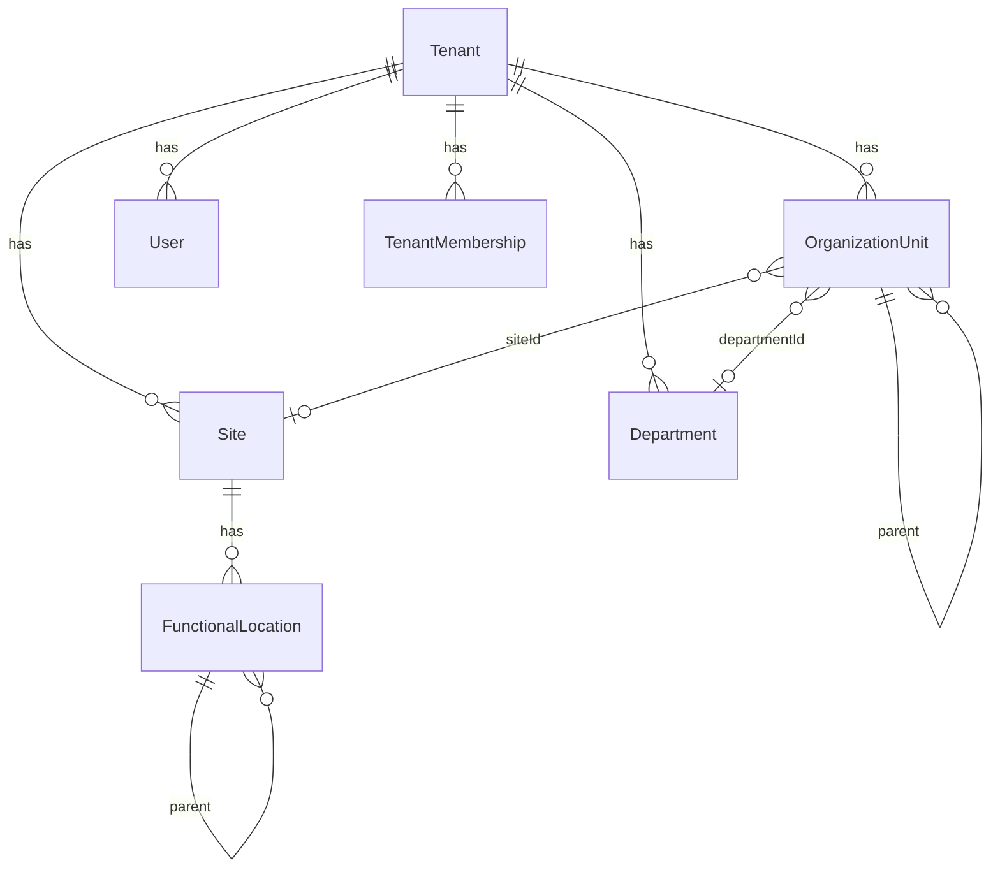
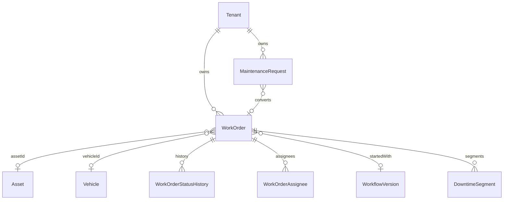
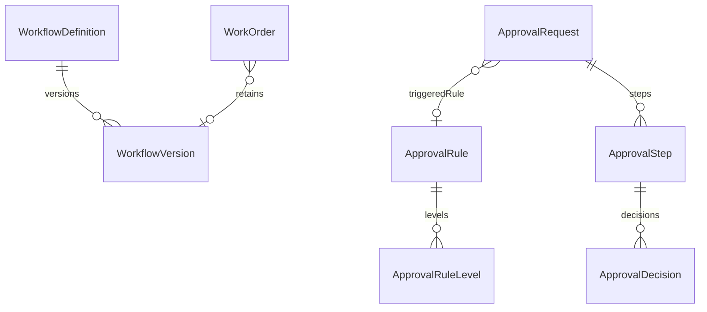
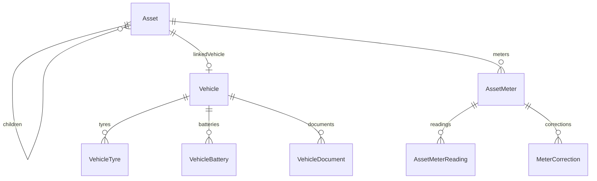
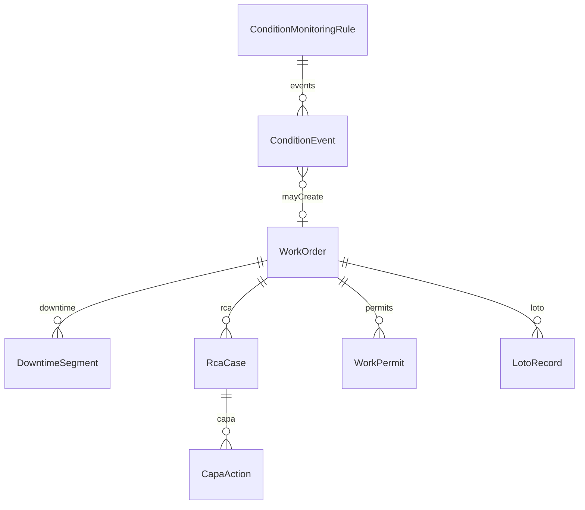
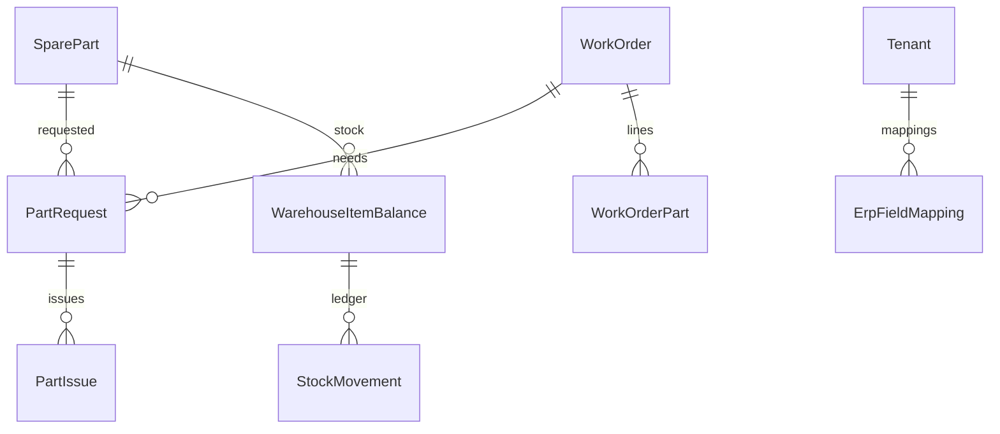
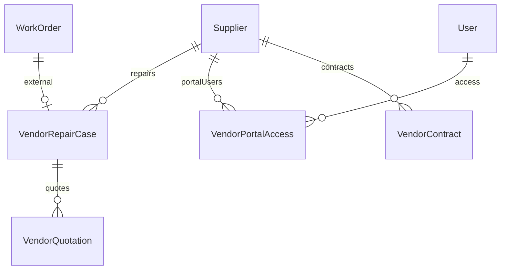
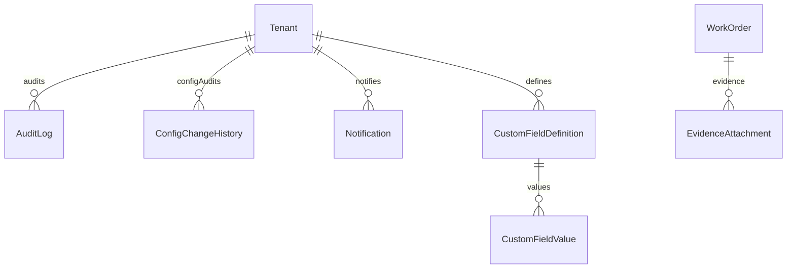

# Data Model

Primary schema: `prisma/schema.prisma` (SQL Server).  
Integrity audit: `docs/DATABASE_MAPPING_AUDIT.md`, `docs/DATABASE_HEALTH_REPORT.md`.

## Recent enterprise / integrity models

| Model | Purpose |
|-------|---------|
| OrganizationUnit | Recursive COMPANY/BRANCH/… hierarchy |
| WorkflowDefinition / WorkflowVersion | Versioned WO workflow |
| NumberingSequence | Tenant document numbering |
| TemporaryRepairRecord | Temporary repair + follow-up |
| VendorPortalAccess | Vendor user isolation |
| MeterCorrection | Meter correction (append reading on approve) |
| CustomFieldDefinition / CustomFieldValue | Controlled dynamic fields |
| SoDPolicy | Configurable segregation of duties |
| OutboundWebhook / Delivery | Outbound events |
| ConfigChangeHistory | Immutable config audit |
| DowntimeSegment / RcaCase / CapaAction | Reliability |
| WorkPermit / LotoRecord | Safety |
| ConditionMonitoringRule / Event | CBM |
| PmAutoGeneration | Deterministic PM duplicate key |

## Vehicle ↔ Asset

Vehicle may link to Asset via optional `assetId` (1:1). WorkOrder uses `assetId` and/or `vehicleId` on one engine.

## Reporting views

`20260917230000` + hardened in `20260917240000`: `vw_rpt_*` — always filter by `tenantId` in Power BI.

---

## ER diagrams (bounded contexts)

### Organization / Identity

### Maintenance Core

### Workflow / Approval

### Asset / Fleet

### Reliability / Safety

### Parts / ERP

### Vendor

### Audit / Documents / Notifications

